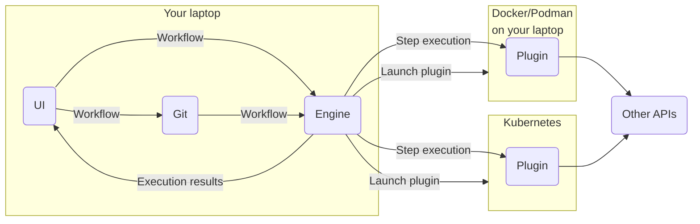

# Arcaflow architecture

The Arcaflow architecture consists of the following 2 keys elements:

1. Plugins
2. The Engine

## Engine

The engine is responsible for the orchestration of the workflow steps. It has several duties:

1. Provide schemas for workflow files, read workflows and construct execution graphs.
2. Type-check the execution graphs to make sure that the data transfers between steps are type-safe.
3. Orchestrate plugin execution with Docker, Podman and Kubernetes.
4. Execute the workflow, following the [workflow rules](workflows.md).

The engine itself is designed to be run from a command line interface, possibly as a webserver, but is not designed to run in a redundant fashion. Instead of implementing redundancy itself, the engine will receive support to execute workflows in third party systems, such as Kafka.

A stretch goal for the engine is to make it fully embeddable, possibly with in-binary workflows and execution images to make them easily to ship in network-restricted environments.

## Plugins

[Plugins](plugins.md) provide execution for one or more **steps** for a workflow. The job of a plugin is to [*do one thing and do it well*](https://en.wikipedia.org/wiki/Unix_philosophy). A plugin provides a thin layer over third party tools, or its own implementation of features. Its main job is to provide accurate input and output schema information to the engine and transform the data as needed.

For example, a plugin may output unformatted text, which a plugin has to parse and build a machine-readable data structure for that information. This reformatting of data allows the engine to pipe data between steps and reliably check the data for faults.

The current plan is to provide plugin SDKs for Python, GO, and Rust (in that order).

## Typing

A core element of the Arcaflow system is the [typing system](typing.md). Each plugin and the engine itself will provide a machine-readable data structure that describes what inputs are expected and what outputs may be produced. If you are familiar with JSON schema or OpenAPI, this is similar, and Arcaflow can produce those schema documents. However, the Arcaflow system is stricter than those industry standards to optimize for performance and simpler implementation in all supported programming languages.

## Executing workflows

[Arcaflow workflows](workflows.md) are orchestrated in the Engine, while plugins can be run locally or remotely on container engines. This lends itself to a Git-based workflow:

