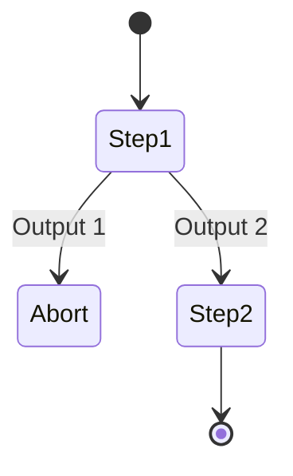
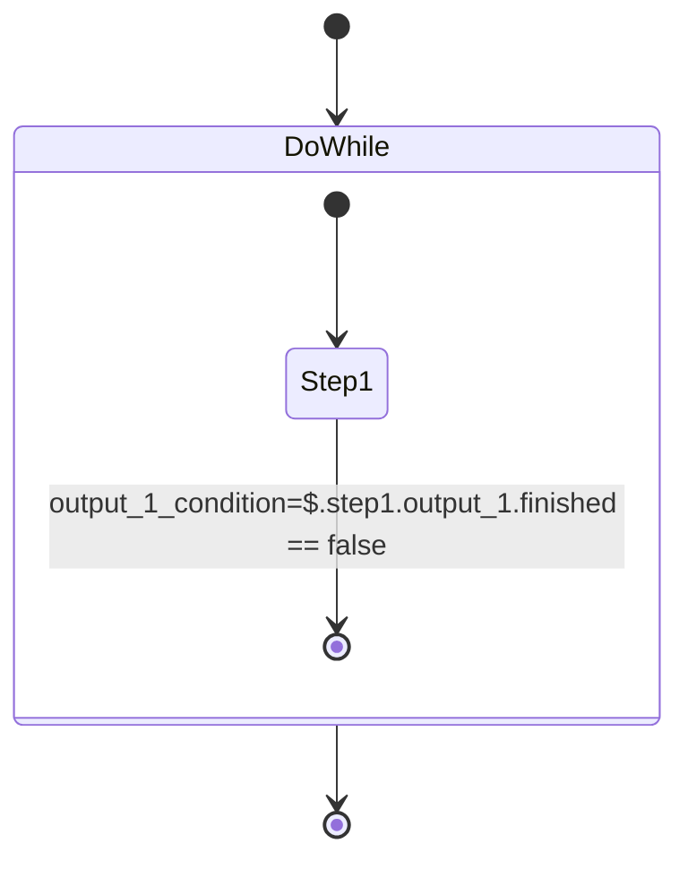
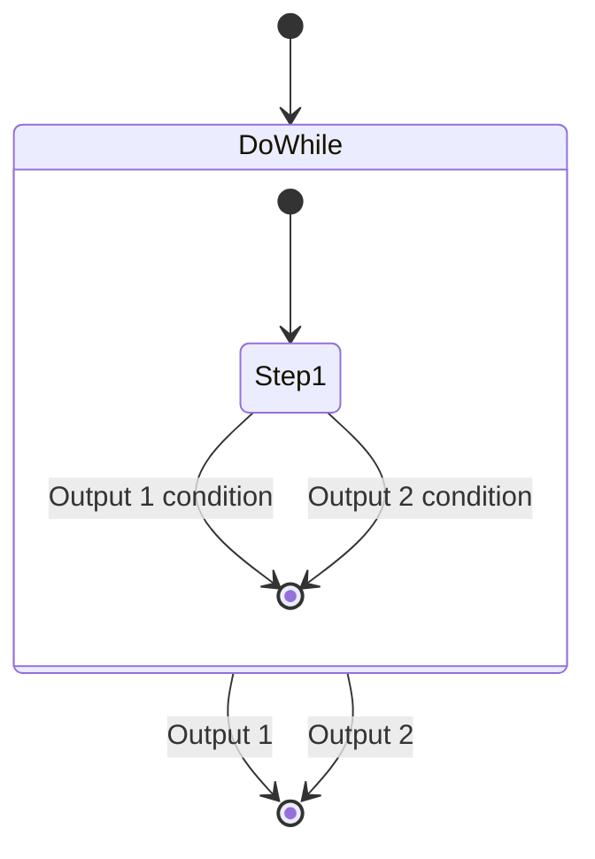
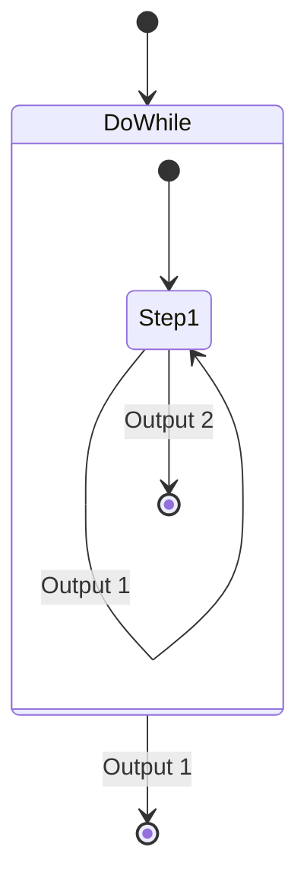
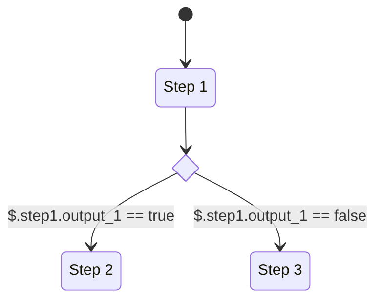
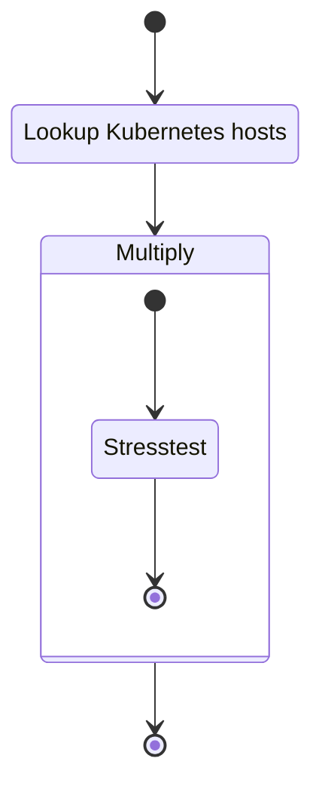
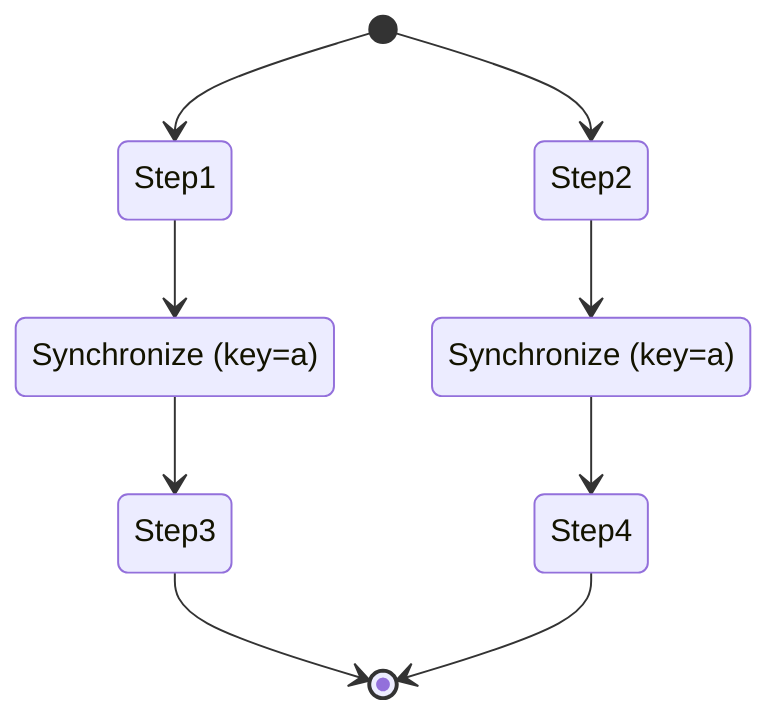

# Flow control (in development)

The workflow contains several flow control operations. These flow control operations are not implemented by plugins, but are part of the workflow engine itself.

## Abort

The abort flow control is a quick way to exit out of a workflow. This is useful when entering a terminal error state and the workflow output data would be useless anyway.

However, this is only required if you want to abort the workflow immediately. If you want an error case to result in the workflow failing, but whatever steps can be finished being finished, you can leave error outputs unconnected.

## Do-while

A do-while block will execute the steps in it as long as a certain condition is met. The condition is derived from the output of the step or steps executed inside the loop:

If the step declares multiple outputs, multiple conditions are possible. The do-while block will also have multiple outputs:

You may decide to only allow exit from a loop if one of the two outputs is satisfied:

## Condition

A condition is a flow control operation that redirects the flow one way or another based on an expression. You can also create multiple branches to create a switch-case effect.

## Multiply

The multiply flow control operation is useful when you need to dynamically execute sub-workflows in parallel based on an input condition. You can, for example, use this to run a workflow step on multiple or all Kubernetes nodes.

The output of a Multiply operation will be a map, keyed with a string that is configured from the input.

!!! tip
    You can think of a Multiply step like a for-each loop, but the steps being executed in parallel.

## Synchronize

The synchronize step attempts to synchronize the execution of subsequent steps for a specified key. The key must be a constant and cannot be obtained from an input expression.

