# Arcaflow Workflows

## Steps

Workflows are a way to describe a sequence or parallel execution of individual steps. The steps are provided exclusively by plugins. The simplest workflow looks like this:

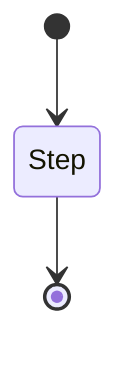

However, this is only true if the step only has one output. Most steps will at least have two possible outputs, for success and error states:

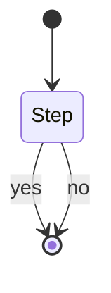

Plugins can declare as many outputs as needed, with custom names. The workflow engine doesn't make a distinction based on the names, all outputs are treated equal for execution. However, a few names are treated special for display purposes only:

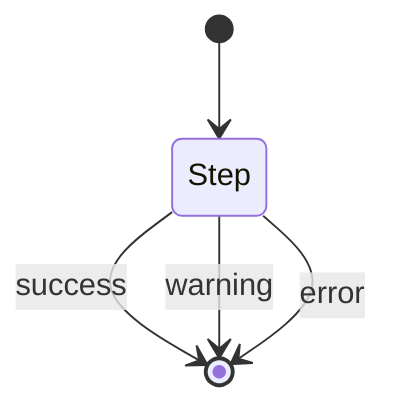

These three output names (`success`, `warning`, and `error`) will be colored accordingly in the user interfaces. Other names may be used, but will not be colored.

An important rule is that one step must always end in exactly one output. No step must end without an output, and no step can end in more than one output. This provides a mechanism to direct the flow of the workflow execution.

Plugins must also explicitly declare what parameters they expect as input for the step, and the data types of these and what parameters they will produce as output. For more detaisl about this see the [Type system page](typing.md).

## Background processes

Each plugin will only be invoked once, allowing plugins to run background processes, such as server applications. The plugins must handle SIGINT and SIGTERM events properly.

## Interconnecting steps

When two steps are connected, they will be executed after each other:

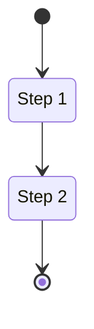

Similarly, when two steps are not directly connected, they may be executed in parallel:

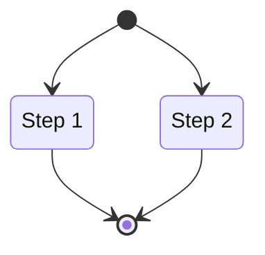

You can use the interconnection to direct the flow of step outputs:

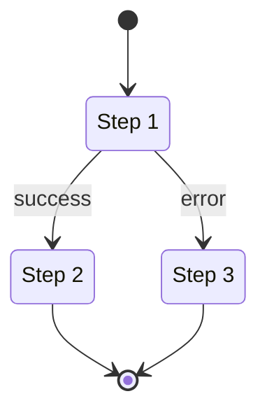

## Unconnected steps

If you leave outputs unconnected, the workflow will be a failure and the engine will exit with a non-zero exit code. However, the engine will still attempt to finish whatever steps it can.

## Passing data between steps 

When two steps are connected, you have the ability to pass data between them. Emblematically described:

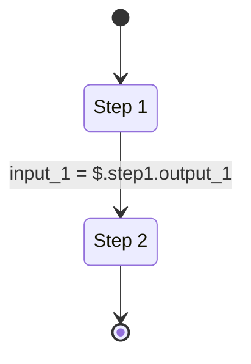

The data type of the input on Step 2 in this case must match the result of the expression. If the data type does not match, the workflow will not be executed.

## Undefined inputs

Step inputs can either be required or optional. When a step input is required, it must be configured or the workflow will fail to execute. However, there are cases when the inputs cannot be determined from previous steps. In this case, the workflow start can be connected and the required inputs can be obtained from the user when running the workflow:

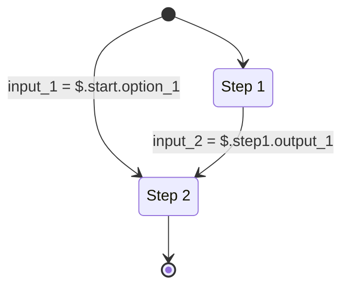

This is typically the case when credentials, such as database access, etc. are required.

## Outputs

The output for each step is preserved for later inspection. However, the workflow can explicitly declare outputs. These outputs are usable in scripted environments as a direct output of the workflow:

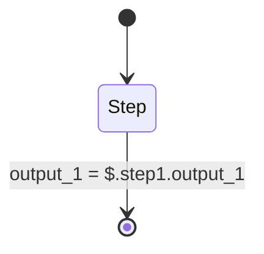

## Execution environment

Workflow plugins will always run in containers. You can configure these containers to run locally, or you can connect a remote execution environment. At this time the two environments that are supported are Docker (or Podman using the Docker compatibility API) and Kubernetes. Later on we plan to add container execution via SSH.

A local Docker (or Docker-like) environment is always required. The workflow engine needs this to obtain schema information from the plugins, as well as for mirroring plugins to a network-disconnected environment.

Plugins must also make sure that they can execute in an unprivileged container, even when they later on need to be executed in a privileged environment. This is needed to obtain the schema before executing it in the target environment.

You can configure any step to run in a remote environment as long as the remote environment can pull the container image. The engine provides the facilities to mirror the required plugins into a disconnected environment. Plugins must not make network calls during startup, and they should come with everything they need to run built in, unless their specific purpose is to install something on step execution. The engine will execute the plugin container image in a network-disconnected environment at startup to obtain its schema. If it fails to execute without internet, the workflow will not run.

The execution environment has further parameters. For Docker, these options are specific to Docker, for Kubernetes they are specific to Kubernetes. For Kubernetes, you can also specify constraints on where the step is executed.

## Flow control

The workflow contains several flow control operations. These flow control operations are not implemented by plugins, but are part of the workflow engine itself.

### Abort

The abort flow control is a quick way to exit out of a workflow. This is useful when entering a terminal error state and the workflow output data would be useless anyway.

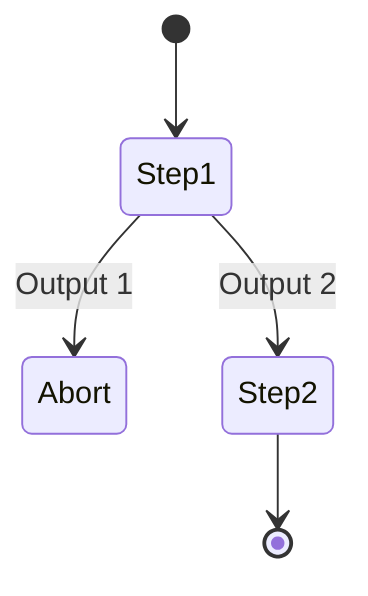

However, this is only required if you want to abort the workflow immediately. If you want an error case to result in the workflow failing, but whatever steps can be finished being finished, you can leave error outputs unconnected.

### Do-while

A do-while block will execute the steps in it as long as a certain condition is met. The condition is derived from the output of the step or steps executed inside the loop:

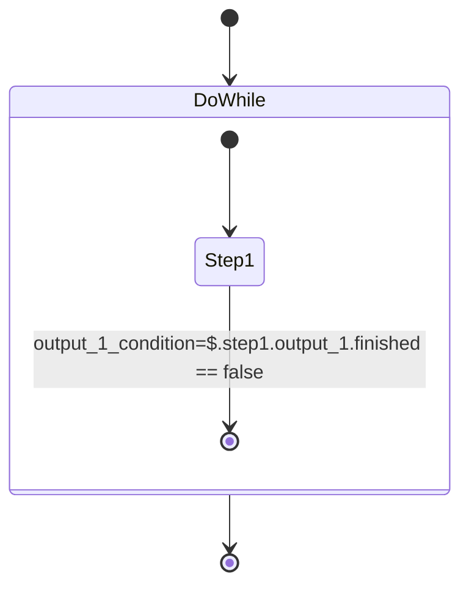

If the step declares multiple outputs, multiple conditions are possible. The do-while block will also have multiple outputs:

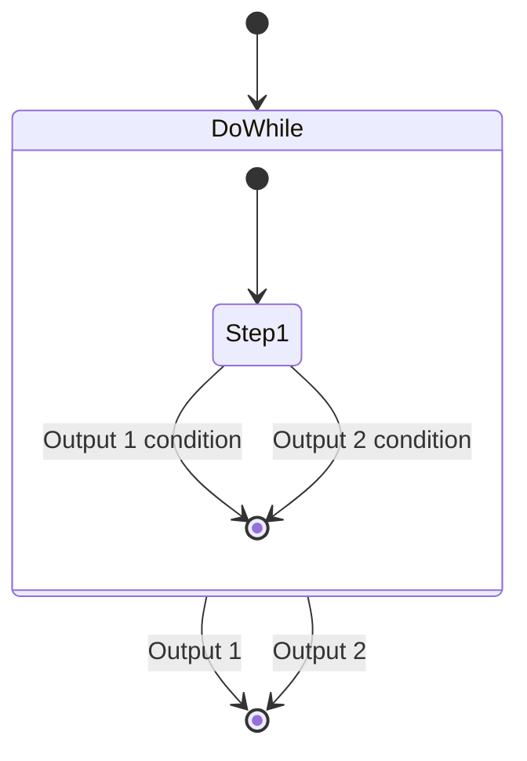

You may decide to only allow exit from a loop if one of the two outputs is satisfied:

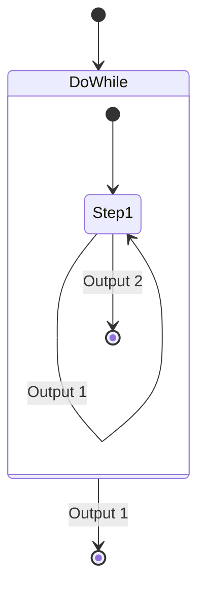

### Condition

A condition is a flow control operation that redirects the flow one way or another based on an expression. You can also create multiple branches to create a switch-case effect.

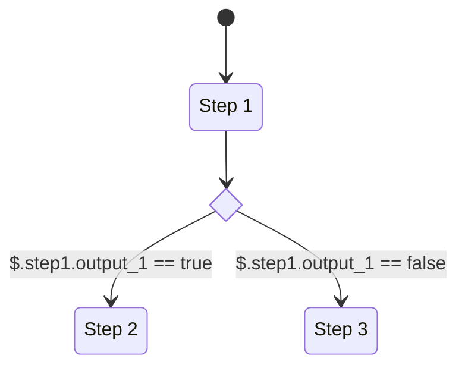

### Multiply

The multiply flow control operation is useful when you need to dynamically execute sub-workflows in parallel based on an input condition. You can, for example, use this to run a workflow step on multiple or all Kubernetes nodes.

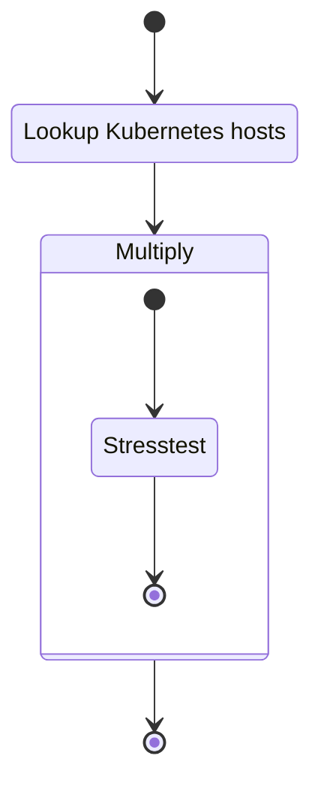

The output of a Multiply operation will be a map, keyed with a string that is configured from the input.

!!! tip
    You can think of a Multiply step like a for-each loop, but the steps being executed in parallel.

### Synchronize

The synchronize step attempts to synchronize the execution of subsequent steps for a specified key. The key must be a constant and cannot be obtained from an input expression.

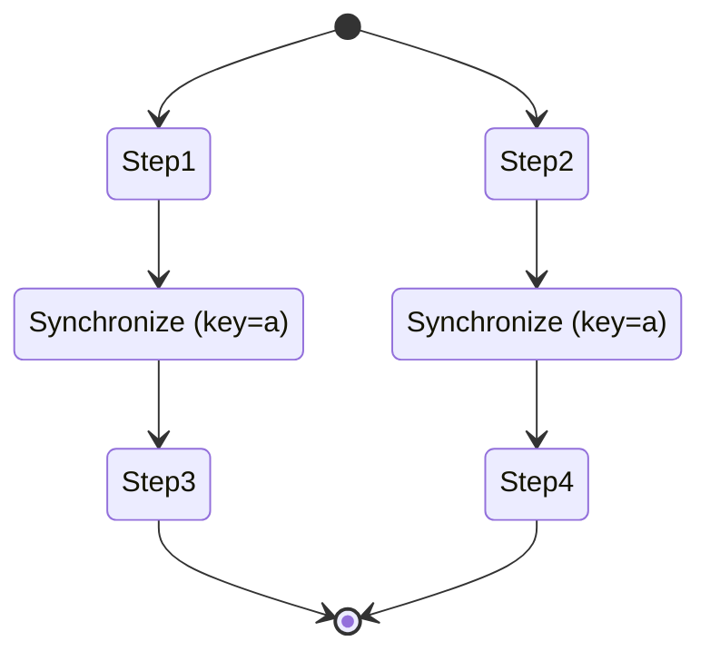