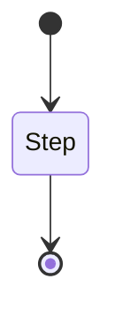
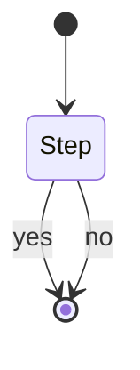
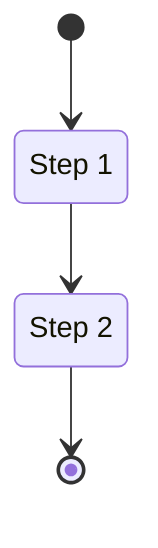
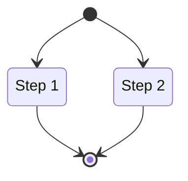
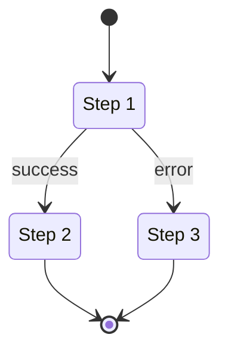
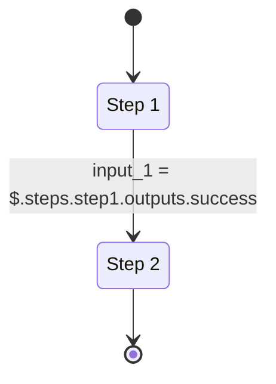
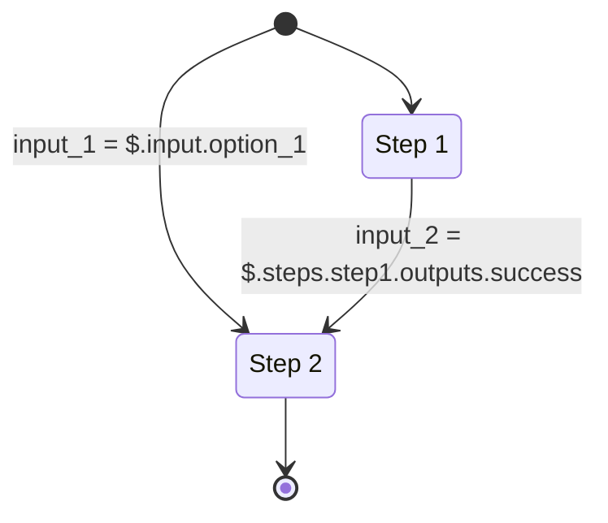
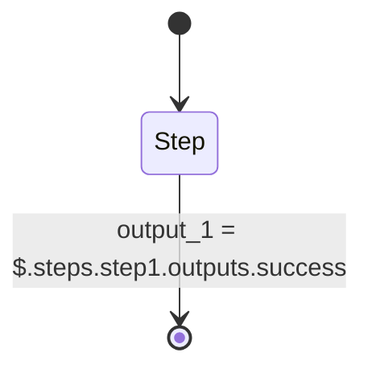

# Arcaflow Workflows (concept)

!!! tip
    This document describes the *concept* of Arcaflow Workflows. We describe the process of writing a workflow [in this section](../workflows/index.md)

## Steps

Workflows are a way to describe a sequence or parallel execution of individual steps. The steps are provided exclusively by plugins. The simplest workflow looks like this:

However, this is only true if the step only has one output. Most steps will at least have two possible outputs, for success and error states:

Plugins can declare as many outputs as needed, with custom names. The workflow engine doesn't make a distinction based on the names, all outputs are treated equal for execution.

An important rule is that one step must always end in exactly one output. No step must end without an output, and no step can end in more than one output. This provides a mechanism to direct the flow of the workflow execution.

Plugins must also explicitly declare what parameters they expect as input for the step, and the data types of these and what parameters they will produce as output.

## Interconnecting steps

When two steps are connected, they will be executed after each other:

Similarly, when two steps are not directly connected, they may be executed in parallel:

You can use the interconnection to direct the flow of step outputs:

## Passing data between steps 

When two steps are connected, you have the ability to pass data between them. Emblematically described:

The data type of the input on Step 2 in this case must match the result of the expression. If the data type does not match, the workflow will not be executed.

## Undefined inputs

Step inputs can either be required or optional. When a step input is required, it must be configured or the workflow will fail to execute. However, there are cases when the inputs cannot be determined from previous steps. In this case, the workflow start can be connected and the required inputs can be obtained from the user when running the workflow:

This is typically the case when credentials, such as database access, etc. are required.

## Outputs

The output for each step is preserved for later inspection. However, the workflow can explicitly declare outputs. These outputs are usable in scripted environments as a direct output of the workflow:

!!! tip "Background processes"
    Each plugin will only be invoked once, allowing plugins to run background processes, such as server applications. The plugins must handle SIGINT and SIGTERM events properly.