# Arcaflow Workflows (concept)

!!! tip
    This document describes the *concept* of Arcaflow Workflows. We describe the process of writing a workflow [in this section](../workflows/index.md)

## Steps

Workflows are a way to describe a sequence or parallel execution of individual steps. The steps are provided exclusively by plugins. The simplest workflow looks like this:

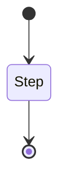

However, this is only true if the step only has one output. Most steps will at least have two possible outputs, for success and error states:

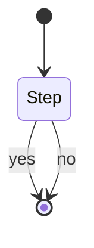

Plugins can declare as many outputs as needed, with custom names. The workflow engine doesn't make a distinction based on the names, all outputs are treated equal for execution.

An important rule is that one step must always end in exactly one output. No step must end without an output, and no step can end in more than one output. This provides a mechanism to direct the flow of the workflow execution.

Plugins must also explicitly declare what parameters they expect as input for the step, and the data types of these and what parameters they will produce as output.

## Interconnecting steps

When two steps are connected, they will be executed after each other:

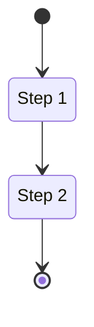

Similarly, when two steps are not directly connected, they may be executed in parallel:

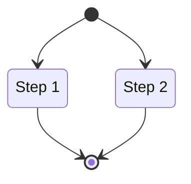

You can use the interconnection to direct the flow of step outputs:

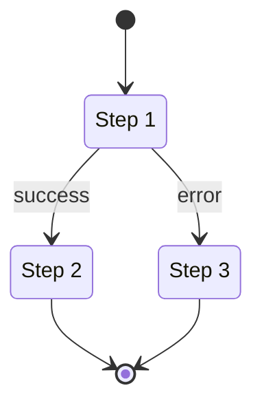

## Passing data between steps

When two steps are connected, you have the ability to pass data between them. Emblematically described:

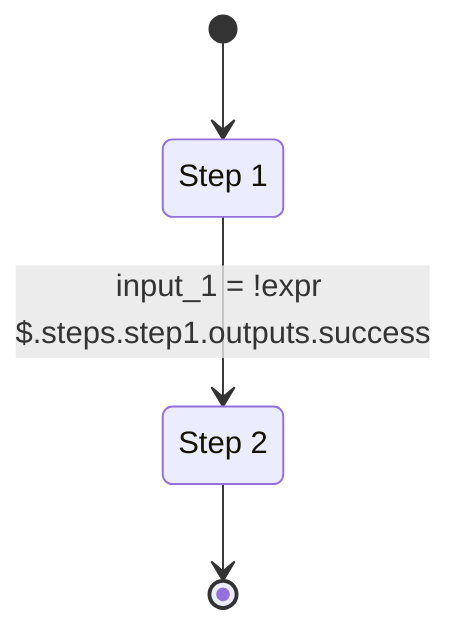

The data type of the input on Step 2 in this case must match the result of the expression. If the data type does not match, the workflow will not be executed.

## Undefined inputs

Step inputs can either be required or optional. When a step input is required, it must be configured or the workflow will fail to execute. However, there are cases when the inputs cannot be determined from previous steps. In this case, the workflow start can be connected and the required inputs can be obtained from the user when running the workflow:

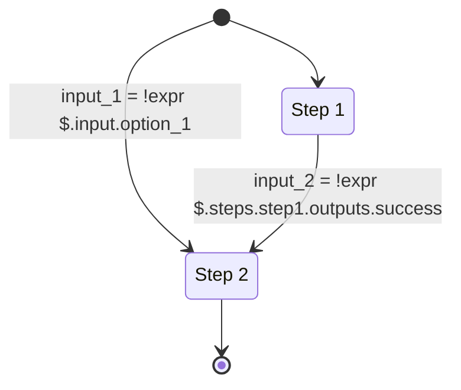

This is typically the case when credentials, such as database access, etc. are required.

## Outputs

The output for each step is preserved for later inspection. However, the workflow can explicitly declare outputs. These outputs are usable in scripted environments as a direct output of the workflow:

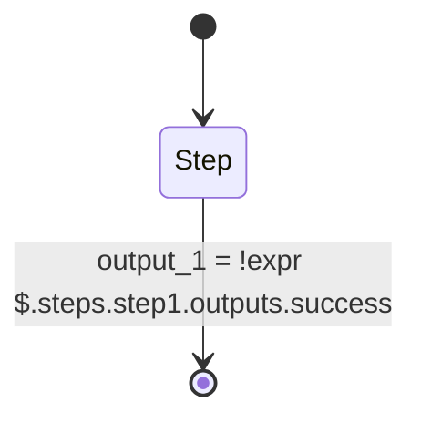

!!! tip "Background processes"
    To allow background processes idiomatically, plugins can implement the cancellation signal to be stopped by the workflow.

## Flow control (WIP)

The workflow contains several flow control operations. These flow control operations are not implemented by plugins, but are part of the workflow engine itself.

### Foreach

The foreach flow control allows you to loop over a sub-workflow with a list of input objects.

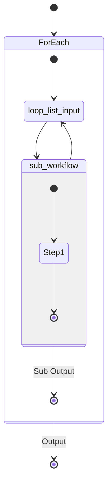

This feature can be configured for parallel or sequential execution.

### Condition

A condition is a flow control operation that controls whether or not a step can run. You can also create multiple branches with opposing logic to create a switch-case effect.

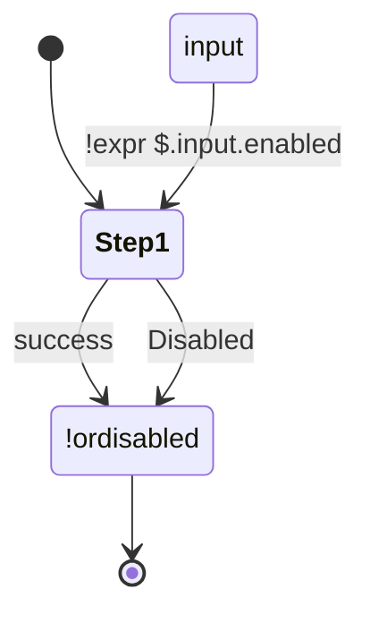

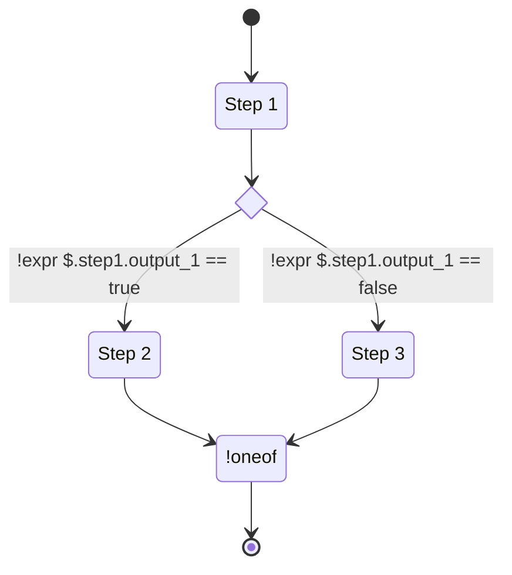

### Abort

!!! warning
    This feature is not yet implemented.

The abort flow control is a quick way to exit out of a workflow. This is useful when entering a terminal error state and the workflow output data would be useless anyway.

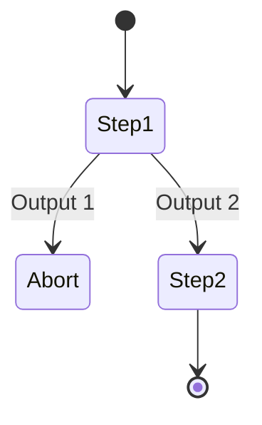

However, this is only required if you want to abort the workflow immediately. If you want an error case to result in the workflow failing, but whatever steps can be finished being finished, you can leave error outputs unconnected.

### Do-while

!!! warning
    This feature is not yet implemented.

A do-while block will execute the steps in it as long as a certain condition is met. The condition is derived from the output of the step or steps executed inside the loop:

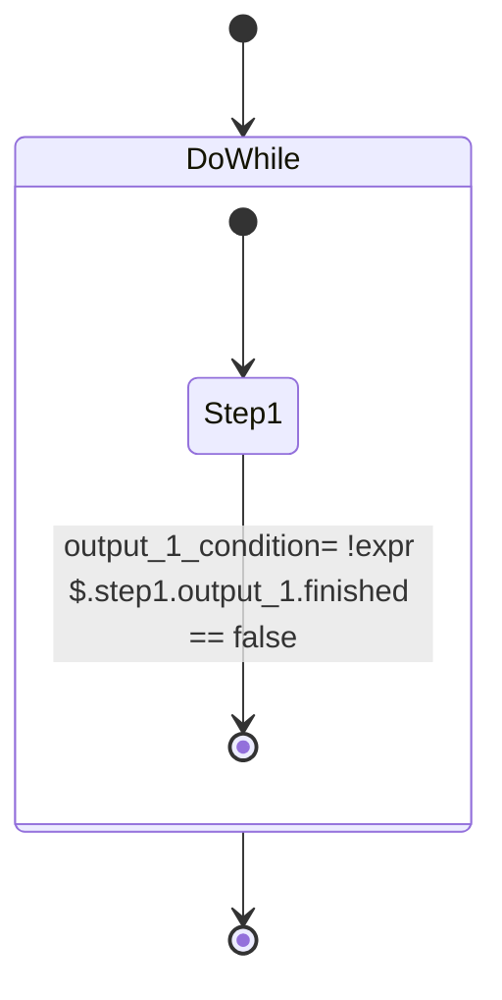

If the step declares multiple outputs, multiple conditions are possible. The do-while block will also have multiple outputs:

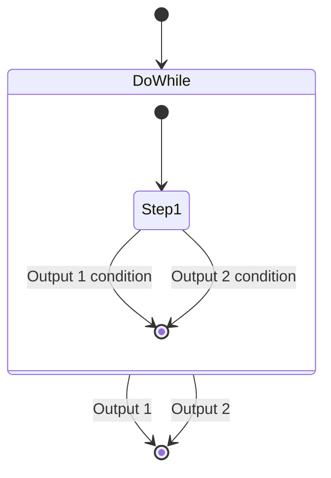

You may decide to only allow exit from a loop if one of the two outputs is satisfied:

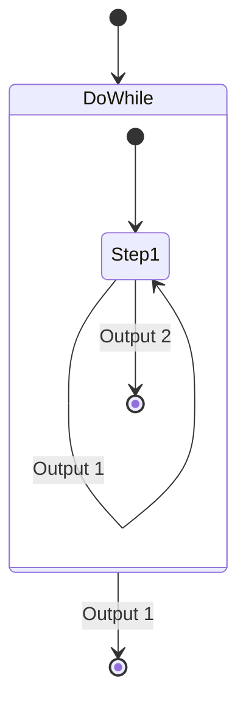

### Multiply

!!! warning
    This feature is not yet implemented.

The multiply flow control operation is useful when you need to dynamically execute sub-workflows in parallel based on an input condition. You can, for example, use this to run a workflow step on multiple or all Kubernetes nodes.

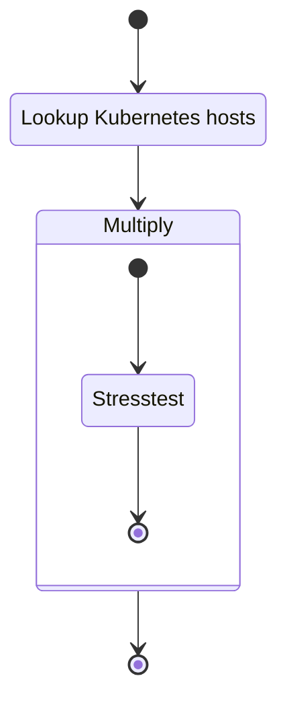

The output of a Multiply operation will be a map, keyed with a string that is configured from the input.

!!! tip
    You can think of a Multiply step like a variation of a for-each loop geared towards specific parallelization cases.

### Synchronize

!!! warning
    This feature is not yet implemented.

The synchronize step attempts to synchronize the execution of subsequent steps for a specified key. The key must be a constant and cannot be obtained from an input expression.

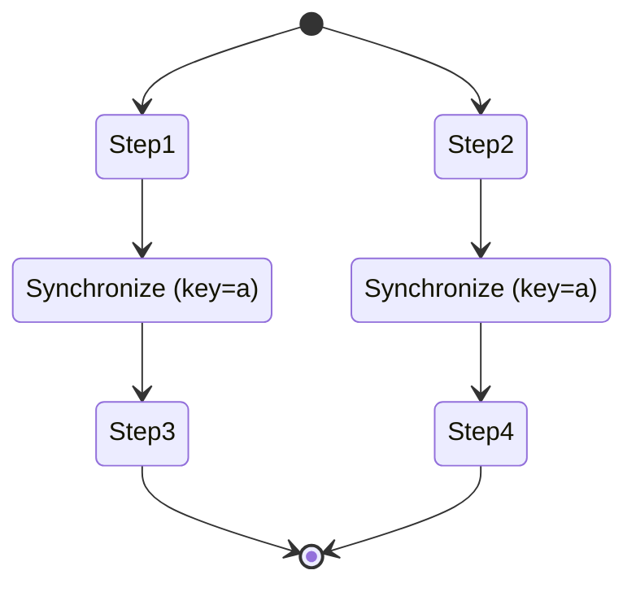