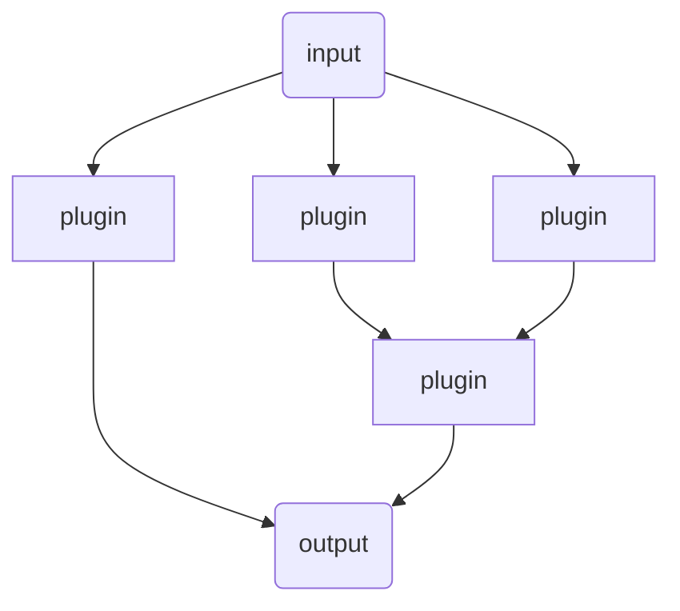
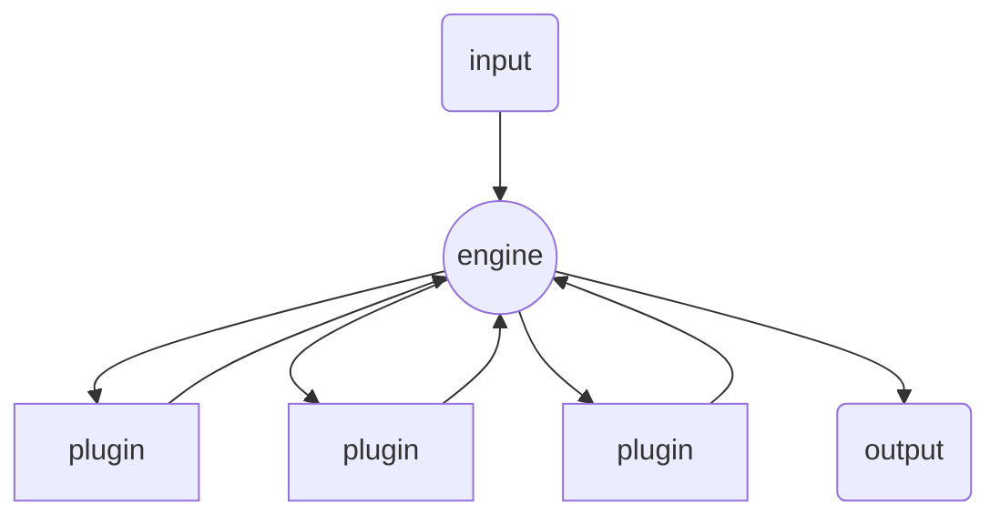
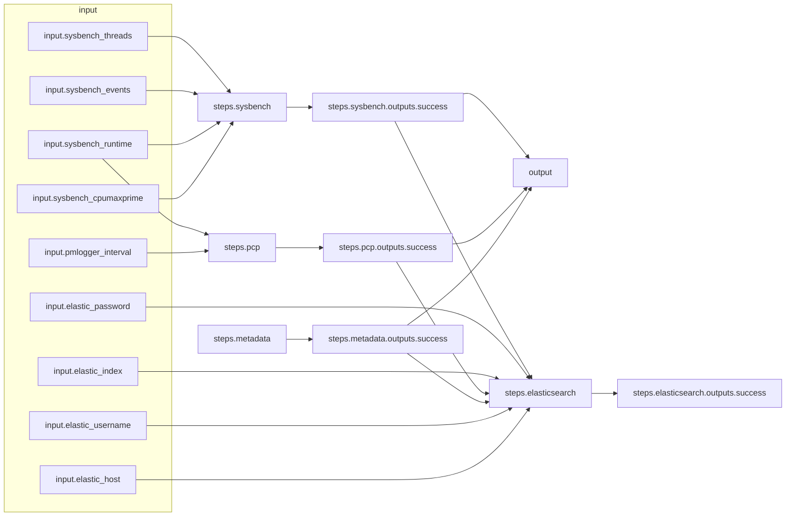

# Arcaflow Getting Started Guide

## Introduction

[Arcaflow](https://arcalot.io/arcaflow/) is a modular system that enables engineers to easily build complex parallelized workflows without requiring any pre-installation or deployment of prerequisite software stacks. It has a **plugin** architecture that is used to build **workflows**, and execution of the workflows is coordinated by an **engine**. Workflows are composable and highly portable, capable of orchestrating complex interrelated actions between plugins. This effectively allows for engineering workflow expertise to be packaged up, version controlled, and shared for repeatability across environments and platforms.
 
The engine component is intended to run from your laptop, jump host, or wherever you have network connectivity to the target environment. No installation is required of any Arcaflow components, either on your system or the target environment. The engine processes the workflow definition, invokes the plugins in the target environment, and passes the required data to the plugins as directed by the workflow.
 
The plugins are containers that can speak the engine's [CBOR](https://cbor.io/) protocol and that have explicitly defined input and output schemas. Plugins can be run locally via Docker or Podman, or in a remote Kubernetes cluster (and in the future on a remote system via SSH and Docker/Podman). Plugins can also be run alone from the command line, independent of the engine.

## Workflow Basics

Logically, a workflow looks like a path being followed from one plugin to another. Functionally, it works in a star pattern with the engine at the center. So the output of a plugin is passed back to the engine, which then hands off data to the next plugin(s).

### Logical Flow


### Functional Flow



## Example Workflow

Consider below a sample workflow that runs a [sysbench](https://github.com/akopytov/sysbench) CPU load, a [PCP](https://pcp.io/) metrics collector, an Ansible [gather facts](https://docs.ansible.com/ansible/latest/collections/ansible/builtin/gather_facts_module.html) metadata collector, and sends the output to an [Elasticsearch](https://www.elastic.co/) index. A bonus feature we get from the engine is that it will output the workflow in [mermaid](https://mermaid-js.github.io/mermaid/#/) format for rendering, so we can see that it looks like this visually (error nodes are removed below for simplicity):



This example workflow expects **input** parameters that are passed down to the plugins, in this case to the **PCP**, **sysbench**, and **elasticsearch** plugins. These parameters determine the details of the actions that those plugins will perform. The **metadata** plugin used here requires no inputs, as evidenced in the workflow diagram. The **success** outputs of the PCP, sysbench, and metadata plugins are then directed both to the elasticsearch plugin and to the **output** of the workflow.
 
*Note: The complete example workflow definition is below in the [Using and Contributing Level 2](#level-2) section.*

## Using and Contributing

The entry point for working with Arcaflow as a new user is intended to be very low. Pre-composed workflows are things you should be able to download and use with very little in terms of prerequisites, allowing you with little experience to run workflows in the same ways as domain experts.

Moving up through layers of sophistication as a user and contributor should be equally straightforward. As you become familiar with [running workflows](#level-0), you may be drawn into [tweaking](#level-1) and [modifying](#level-2) those workflows to suit your needs, or further into [authoring new plugins](#level-3) to expand functionality or even into [contributing to our core components](#level-4). The sections below should give you an idea of how to get started at each level of sophistication.

### Level 0
***Yeoman - Workflow User***

Welcome to the community! We are more than happy to help you get started. You should get a feel for things by running a workflow or two. Below is an example you can try out. You will need a Golang runtime and Docker to run the containers (Podman can be used with the [system service](https://docs.podman.io/en/latest/markdown/podman-system-service.1.html) enabled for socket connections, which are required by the engine to communicate with the plugins). The example used here is the same one from the [Example Workflow](#example-workflow) section above.

Clone the [engine](https://github.com/arcalot/arcaflow-engine):
```
$ git clone https://github.com/arcalot/arcaflow-engine.git
```

Clone the [workflows](https://github.com/arcalot/arcaflow-workflows) and set your workflow directory path:
```
$ git clone https://github.com/arcalot/arcaflow-workflows.git
$ export WFPATH=$(pwd)/arcaflow-workflows/example-workflow
```

Run the workflow (the containers will run on your local machine via Docker):
```
$ cd arcaflow-engine
$ go run cmd/arcaflow/main.go -input ${WFPATH}/input.yaml -config ${WFPATH}/config.yaml -context ${WFPATH}
```

The `config.yaml` file is set for debug output, so you'll get a lot returned to the terminal (including the mermaid code mentioned above). This workflow is set to simply return the output of the various plugins, so in the end you'll get that formatted content dumped to the terminal.

### Level 1
***Page - Advanced Workflow User***

The next layer of sophistication is modifying the test parameters, which are in the input.yaml file referenced in the above command. For our simple workflow here, you have parameters to adjust how the CPU stress test is performed and to adjust the resolution of PCP's data collection. You can freely adjust these parameters to your needs without needing to change anything about the workflow itself. This requires some understanding of what the underlying sysbench and PCP tools do, and of course caution should be taken since this test will apply load to the system where it is run.
 
The example `input.yaml` file looks like this:
```yaml
pmlogger_interval: 1
sysbench_threads: 20
sysbench_events: 0
sysbench_cpumaxprime: 12000
sysbench_runtime: 20
elastic_host: foo
elastic_username: foo
elastic_password: foo
elastic_index: foo
```

### Level 2
***Squire - Workflow Creator***

So you're more adventurous and want to change/author workflows? This is the layer at which we think most of our technical users will spend a majority of their effort. Our goals of packaging, version controlling, and shipping domain expertise are primarily facilitated here. A workflow author dreams up a series of tests with various loops and parallelizations they want to run, determines how to collect and transport data and metadata, and then bundles this all into a workflow that can be shared as easily as the one presented in the examples above. A workflow user just needs the engine and your workflow file. That's it.

The workflow file has an **input** section where it defines the workflow schema. The workflow author can get creative here in how they want to represent the available parameters to the user, and there are mechanics for self-documentation when good practices are followed with schema metadata. Then there is a **steps** section, which defines the plugins and their relationships. In the reference examples here, we show some data passing both from the input section to the plugins and between plugins where outputs are passed to the elasticsearch plugin (we have another [example with uperf](https://github.com/arcalot/arcaflow-workflows/tree/main/network-streaming-performance-k8s/) that gets more complicated with kubernetes and data passing, once you're ready to dig in more). Then finally the **output** section defines what the workflow will return to the user.

The complete workflow definition for the example above looks like this:
```yaml
input:
  root: RootObject
  objects:
    RootObject:
      id: RootObject
      properties:
        pmlogger_interval:
          display:
            description: The logger collection interval for PCP pmlogger
            name: PCP pmlogger collection interval
          type:
            type_id: integer
        sysbench_threads:
          display:
            description: The number of threads sysbench will run
            name: sysbench threads
          type:
            type_id: integer
        sysbench_events:
          display:
            description: The number of events sysbench will run
            name: sysbench events
          type:
            type_id: integer
        sysbench_cpumaxprime:
          display:
            description: The upper limit of the number of prime numbers generated
            name: sysbench cpu max primes
          type:
            type_id: integer
        sysbench_runtime:
          display:
            description: The total runtime in seconds for the sysbench tests
            name: sysbench runtime seconds
          type:
            type_id: integer
        elastic_host:
          display:
            description: The host URL for the ElasticSearch service
            name: elasticsearch host url
          type:
            type_id: string
        elastic_username:
          display:
            description: The username for the ElasticSearch service
            name: elasticsearch username
          type:
            type_id: string
        elastic_password:
          display:
            description: The password for the ElasticSearch service
            name: elasticsearch password
          type:
            type_id: string
        elastic_index:
          display:
            description: The index for the ElasticSearch service
            name: elasticsearch index
          type:
            type_id: string
steps:
  pcp:
    plugin: quay.io/dustinblack/arcaflow-plugin-pcp-test:latest
    step: start-pcp
    input:
      pmlogger_interval: !expr $.input.pmlogger_interval
      run_duration: !expr $.input.sysbench_runtime
  sysbench:
    plugin: quay.io/arcalot/arcaflow-plugin-sysbench:latest
    step: sysbenchcpu
    input:
      operation: cpu
      threads: !expr $.input.sysbench_threads
      events: !expr $.input.sysbench_events
      cpumaxprime: !expr $.input.sysbench_cpumaxprime
      time: !expr $.input.sysbench_runtime
  metadata:
    plugin: quay.io/arcalot/arcaflow-plugin-metadata:latest
    input: {}
  elasticsearch:
    plugin: quay.io/arcalot/arcaflow-plugin-elasticsearch:latest
    input:
      url: !expr $.input.elastic_host
      username: !expr $.input.elastic_username
      password: !expr $.input.elastic_password
      index: !expr $.input.elastic_index
      data:
        pcp: !expr $.steps.pcp.outputs.success
        sysbench: !expr $.steps.sysbench.outputs.success
        metadata: !expr $.steps.metadata.outputs.success
output:
  pcp: !expr $.steps.pcp.outputs.success
  sysbench: !expr $.steps.sysbench.outputs.success
  metadata: !expr $.steps.metadata.outputs.success
```

### Level 3
***Knight - Plugin Author***

So now you want to build plugins or add features to existing plugins? Great! Welcome to the [Arcalot Round Table](https://github.com/arcalot/arcalot-round-table)! We provide Software Development Kits (SDKs) for [Python](https://github.com/arcalot/arcaflow-plugin-sdk-python) and [Golang](https://github.com/arcalot/arcaflow-plugin-sdk-go) to get you started. The main thing you need to understand is that a plugin is expected to define and adhere to its schemas, so the SDK enforces strict typing, which can be a little strange at first for a Python developer. Optimally, a plugin follows the [Unix philosophy](https://en.wikipedia.org/wiki/Unix_philosophy#:~:text=The%20Unix%20philosophy%20is%20documented,%2C%20as%20yet%20unknown%2C%20program.) of *do one thing and do it well*, and a plugin should not be created in an opinionated way.

When creating a plugin, you should consider how you will expose all parameters and configuration values via a single schema, and collect all output similarly in a single schema. The plugins provide the API endpoints for functions or actions, and workflows glue together those endpoints to make use of the data in an opinionated way. Sometimes creating a schema for an existing tool is relatively [easy](https://github.com/arcalot/arcaflow-plugin-smallfile), sometimes it is pretty [involved](https://github.com/arcalot/arcaflow-plugin-uperf). You can start digging into the technical details more in the [Concepts](https://arcalot.io/arcaflow/concepts/workflows/) and [Plugins](https://arcalot.io/arcaflow/creating-plugins/python/) sections of the documentation.


### Level 4
***Liege - Core Components Contributor***

If you have a grasp on everything above and still want to dig in deeper, then welcome to core components development! Here you can participate in the development of the workflow engine and its related libraries, the SDKs, the [build system](https://github.com/arcalot/arcaflow-plugin-image-builder), and more.

## Community

If you're looking for a place to jump in and help, have a look at our [Project](https://github.com/orgs/arcalot/projects) boards and our [Discussions](https://github.com/orgs/arcalot/discussions) page. We also manage our charter, code of conduct, and licensing, as well as significant project decisions, via our [Arcalot Round Table](https://github.com/arcalot/arcalot-round-table) project. We can also always use help with our [documentation](https://github.com/arcalot/arcalot.github.io) efforts.
