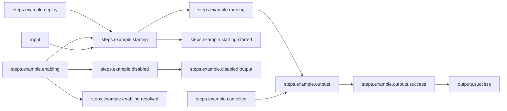

# Arcaflow Getting Started Guide

## Running Workflows
An Arcaflow workflow is a definition of steps structured together to perform complex
actions. Workflows are defined as machine-readable YAML and therefore can be
version-controlled and shared easily to run in different environments. A workflow is a
way of encapsulating and sharing expertise and ensuring reproducible results.

The requirements for running a workflow are simple. You just need the
[Arcaflow engine binary](https://github.com/arcalot/arcaflow-engine/releases),
a workflow definition file, and, typically, an input file. You can also provide a config
file, which allows for setting workflow defaults, such as log levels. The contents of
the input and configuration files, like the workflow file, are YAML. Finally, you need
an appropriate container platform, such as Podman, Docker, or Kubernetes, as the target
of the workflow execution.

!!! note
    The default container platform for the Arcaflow engine is Podman. To use another
    platform, a [configuration file](/arcaflow/running/setup/#configuration) is
    required.

A repository of [example workflows](https://github.com/arcalot/arcaflow-workflows) is
available for reference and practice. Let's try running the
[basic example](https://github.com/arcalot/arcaflow-workflows/basic-examples/basic).

First we will clone the example workflows repository:

```bash
git clone https://github.com/arcalot/arcaflow-workflows.git
```

Then we will run the workflow, setting the workflow directory as the context, and
defining the workflow, configuration, and input files to use:

```bash
arcaflow --context arcaflow-workflows/basic-examples/basic/ \
--workflow workflow.yaml --config config.yaml --input input.yaml
```

Arcaflow will display logs, the detail of which determined by the configuration file,
and then will return the machine-readable output of the workflow in YAML format:

```yaml title="basic workflow output YAML"
output_data:
    example:
        message: Hello, Arcalot!
output_id: success
```


It's that simple! And the basics of running a workflow are the same, whether it's this
single-step hello-world example:



... or a much more complex workflow like this
[stress-ng plus PCP data collection](https://github.com/arcalot/arcaflow-workflows/tree/main/advanced-examples/system-performance/stressng-pcp)
example:



```mermaid
%% Mermaid markdown workflow
flowchart LR
%% Success path
steps.pcp.enabling-->steps.pcp.disabled
steps.pcp.enabling-->steps.pcp.enabling.resolved
steps.pcp.enabling-->steps.pcp.starting
steps.stressng.disabled-->steps.stressng.disabled.output
steps.stressng.cancelled-->steps.stressng.outputs
steps.pre_wait.cancelled-->steps.pre_wait.outputs
steps.pcp.outputs.success-->outputs.success
steps.pcp.disabled-->steps.pcp.disabled.output
steps.uuidgen.outputs.success-->outputs.success
steps.uuidgen.outputs-->steps.uuidgen.outputs.success
steps.pre_wait.running-->steps.pre_wait.outputs
steps.pcp.starting-->steps.pcp.starting.started
steps.pcp.starting-->steps.pcp.running
steps.pcp.starting.started-->steps.pre_wait.starting
steps.pcp.running-->steps.pcp.outputs
steps.uuidgen.starting-->steps.uuidgen.starting.started
steps.uuidgen.starting-->steps.uuidgen.running
steps.pre_wait.disabled-->steps.pre_wait.disabled.output
steps.stressng.deploy-->steps.stressng.starting
steps.pcp.outputs-->steps.pcp.outputs.success
steps.stressng.outputs-->steps.stressng.outputs.success
steps.stressng.outputs-->steps.post_wait.starting
steps.post_wait.cancelled-->steps.post_wait.outputs
steps.stressng.outputs.success-->outputs.success
steps.pre_wait.enabling-->steps.pre_wait.enabling.resolved
steps.pre_wait.enabling-->steps.pre_wait.starting
steps.pre_wait.enabling-->steps.pre_wait.disabled
steps.post_wait.outputs-->steps.post_wait.outputs.success
steps.post_wait.outputs-->steps.pcp.cancelled
steps.uuidgen.disabled-->steps.uuidgen.disabled.output
steps.uuidgen.cancelled-->steps.uuidgen.outputs
steps.pcp.cancelled-->steps.pcp.outputs
steps.stressng.enabling-->steps.stressng.starting
steps.stressng.enabling-->steps.stressng.disabled
steps.stressng.enabling-->steps.stressng.enabling.resolved
steps.stressng.running-->steps.stressng.outputs
steps.post_wait.starting-->steps.post_wait.starting.started
steps.post_wait.starting-->steps.post_wait.running
steps.uuidgen.deploy-->steps.uuidgen.starting
steps.uuidgen.running-->steps.uuidgen.outputs
steps.post_wait.deploy-->steps.post_wait.starting
steps.stressng.starting-->steps.stressng.starting.started
steps.stressng.starting-->steps.stressng.running
steps.pcp.deploy-->steps.pcp.starting
steps.post_wait.disabled-->steps.post_wait.disabled.output
steps.post_wait.running-->steps.post_wait.outputs
steps.pre_wait.outputs-->steps.pre_wait.outputs.success
steps.pre_wait.outputs-->steps.stressng.starting
steps.uuidgen.enabling-->steps.uuidgen.enabling.resolved
steps.uuidgen.enabling-->steps.uuidgen.starting
steps.uuidgen.enabling-->steps.uuidgen.disabled
steps.pre_wait.starting-->steps.pre_wait.starting.started
steps.pre_wait.starting-->steps.pre_wait.running
steps.post_wait.enabling-->steps.post_wait.enabling.resolved
steps.post_wait.enabling-->steps.post_wait.starting
steps.post_wait.enabling-->steps.post_wait.disabled
steps.pre_wait.deploy-->steps.pre_wait.starting
input-->steps.stressng.starting
input-->steps.pcp.starting
```

[Learn more about running workflows &raquo;](/arcaflow/running/){ .md-button }

## Writing Workflows
As a workflow author, you determine the steps of the workflow, how data will pass
between the steps, what input is required from the workflow user, and what output will
be returned. It is possible to build very complex workflows with data translations,
sub-workflows, parallelisim and serialization, and multiple output paths.

Let's start with something simple. Our workflow will collect a `nickname` input from the
user and will pass that input to an example "Hello world!" step. The workflow will also
run a UUID generation step in parallel to the example step, and it will return both the
UUID and a greeting.

In the first part of the `workflow.yaml` file we will define the workflow compatibility
version and the input schema for the workflow. In the input schema, we are expecting
only a single input called `nickname` with a type of `string`.

```yaml title="workflow.yaml (excerpt)"
version: v0.2.0
input:
  root: RootObject
  objects:
    RootObject:
      id: RootObject
      properties:
        nickname:   #<<== Input key name
          display:
            description: Just a name
            name: Name
          required: true
          type:
            type_id: string   #<<== Input value type
...
```

Next we will define the steps of the workflow. The steps are to be deployed as container
images, where the `src` field defines the image and tag. The `arcaflow-plugin-utilities`
plugin has multiple steps available, so we indicate with the `step: uuid` field which
step we want to run. The `arcaflow-plugin-example` plugin has only one step, so the
`step` field is not required. The `uuidgen` step requires no input, so we pass an empty
object `{}` to it. The `example` plugin requires an input object of `name` with
`_type` and `nick` fields. We statically set the value of the `_type` field in the
input object of the step, and then we use the
[Arcaflow expression language](/arcaflow/workflows/expressions/) to reference the
workflow input value for `nickname` as the input to the plugin's `nick` field.

```yaml title="workflow.yaml (excerpt)"
...
steps:
  uuidgen:   #<<== Step name
    plugin:
      deployment_type: image
      src: quay.io/arcalot/arcaflow-plugin-utilities:0.6.0   #<<== Container image
    step: uuid   #<<== Specific plugin step
    input: {}   #<<== Step does not require input
  example:   #<<== Step name
    plugin:
      deployment_type: image
      src: quay.io/arcalot/arcaflow-plugin-example:0.5.0   #<<== Container image
    input:
      name:
        _type: nickname   #<<== Statically-defined input
        nick: !expr $.input.nickname   #<<== Referenced workflow input
...
```

Finally we define the outputs that we expect when the workflow succeeds. The workflow
will run until all of the items referenced in the `success` sub-object become available
or until a step that one of the items depends on fails. Once all of the items referenced
in the `success` sub-object become available, the engine will terminate any steps which
have not yet completed, and it will return the `success` sub-object. If a required step
fails, then the workflow will fail.

!!! tip
    It is possible to define multiple sub-objects for `outputs` with different
    dependencies. In this case, the output sub-oject that has its dependencies satisfied
    first will be the one that returns and ends the workflow. See the
    [documentation](/arcaflow/workflows/output) for more info.

```yaml title="workflow.yaml (excerpt)"
...
outputs:
 success:
   uuid: !expr $.steps.uuidgen.outputs.success
   example: !expr $.steps.example.outputs.success
```

Our final workflow looks like this:

```yaml title="workflow.yaml"
version: v0.2.0
input:
  root: RootObject
  objects:
    RootObject:
      id: RootObject
      properties:
        nickname:
          display:
            description: Just a name
            name: Name
          required: true
          type:
            type_id: string

steps:
  uuidgen:
    plugin:
      deployment_type: image
      src: quay.io/arcalot/arcaflow-plugin-utilities:0.6.0
    step: uuid
    input: {}
  example:
    plugin:
      deployment_type: image
      src: quay.io/arcalot/arcaflow-plugin-example:0.5.0
    input:
      name:
        _type: nickname
        nick: !expr $.input.nickname

outputs:
 success:
   uuid: !expr $.steps.uuidgen.outputs.success.uuid
   example: !expr $.steps.example.outputs.success.message
```

We will create an input file to satisfy the input schema of the workflow:

```yaml title="input.yaml"
nickname: Arcalot
```

We will also create a configuration file, setting the container deployer to Podman and
the log levels to `error`:

```yaml title="config.yaml"
log:
  level: error
logged_outputs:
  error:
    level: error
deployers:
  image:
    deployer_name: podman
```

And now we can run our new workflow:

!!! tip
    The default workflow file is `workflow.yaml` so we don't need to specifiy it here
    explicitly.

```bash
arcaflow --config config.yaml --input input.yaml
```

```yaml title="example workflow output YAML"
output_data:
    example: Hello, Arcalot!
    uuid: b98909c2-4a25-4cc1-8222-3290b0621129
output_id: success
```

[Learn more about workflow concepts &raquo;](/arcaflow/concepts/workflows/){ .md-button }

[Learn more about writing workflows &raquo;](/arcaflow/workflows/){ .md-button }

[See more example workflows &raquo;](https://github.com/arcalot/arcaflow-workflows){ .md-button }

!!! tip "Did you know?"
    Arcaflow provides [Mermaid](https://mermaid.js.org/) markdown in the workflow debug
    output that allows you to quickly visualize the workflow in a graphic format. You
    can grab the Mermaid graph you see in the output and put it into a
    [Mermaid editor](https://mermaid.live/edit#pako:eNqdVLFugzAQ_ZXoZoIIBAIMnTq2S7tVLK59SZCMjbDdJo3y73UTiBojiySe7Ht-707vzj4AlQyhhDWX33RLOj17eavErF9KY6tCY2q2QRGiIJ-8Fpv5_OkaUNoSLXA3kdXKIsjuJg5A2KGS_MuvII1ujVYjgT4eKkMpKuXScUealmNIiaDIbYUXgQHpBXxER9_SvRlrYeMj_SlPB-u8nvYlTBhzS4HXhY0Su4An8XCtM0L8b-mNho5GwQW8ozCp4LN6kugbX1fYm_G8eUCgN9HbI2y53N8_U9e0qeftdM7XUd9ADfLjN-bMqI_oTtKNtJGpLuDryqRAXxAE0GDXkJrZj_Xwp1KB3mKDFZR2y3BNDNcVVOJorxKj5fteUCjXhCsMwLSMaHyuyaYjzSWKrNayez3_1qdPO4CWiA8p7R3dGTwdoTzADspVmKdZushXSZJGSV4EsIcyjhIbXmZxHC3zpCiKYwA_J_oijM5rka3SZZxm2fEXU_Uc4g).

    === "Mermaid markdown"
        ```
        flowchart LR
        steps.uuidgen.enabling-->steps.uuidgen.starting
        steps.uuidgen.enabling-->steps.uuidgen.disabled
        steps.uuidgen.enabling-->steps.uuidgen.enabling.resolved
        steps.uuidgen.outputs-->steps.uuidgen.outputs.success
        steps.example.cancelled-->steps.example.outputs
        steps.example.outputs.success-->outputs.success
        input-->steps.example.starting
        steps.uuidgen.disabled-->steps.uuidgen.disabled.output
        steps.uuidgen.outputs.success-->outputs.success
        steps.example.disabled-->steps.example.disabled.output
        steps.example.running-->steps.example.outputs
        steps.example.enabling-->steps.example.enabling.resolved
        steps.example.enabling-->steps.example.starting
        steps.example.enabling-->steps.example.disabled
        steps.example.starting-->steps.example.starting.started
        steps.example.starting-->steps.example.running
        steps.example.deploy-->steps.example.starting
        steps.uuidgen.deploy-->steps.uuidgen.starting
        steps.example.outputs-->steps.example.outputs.success
        steps.uuidgen.cancelled-->steps.uuidgen.outputs
        steps.uuidgen.running-->steps.uuidgen.outputs
        steps.uuidgen.starting-->steps.uuidgen.starting.started
        steps.uuidgen.starting-->steps.uuidgen.running
        ```

    === "Mermaid rendered flowchart"
        ```mermaid
        flowchart LR
        steps.uuidgen.enabling-->steps.uuidgen.starting
        steps.uuidgen.enabling-->steps.uuidgen.disabled
        steps.uuidgen.enabling-->steps.uuidgen.enabling.resolved
        steps.uuidgen.outputs-->steps.uuidgen.outputs.success
        steps.example.cancelled-->steps.example.outputs
        steps.example.outputs.success-->outputs.success
        input-->steps.example.starting
        steps.uuidgen.disabled-->steps.uuidgen.disabled.output
        steps.uuidgen.outputs.success-->outputs.success
        steps.example.disabled-->steps.example.disabled.output
        steps.example.running-->steps.example.outputs
        steps.example.enabling-->steps.example.enabling.resolved
        steps.example.enabling-->steps.example.starting
        steps.example.enabling-->steps.example.disabled
        steps.example.starting-->steps.example.starting.started
        steps.example.starting-->steps.example.running
        steps.example.deploy-->steps.example.starting
        steps.uuidgen.deploy-->steps.uuidgen.starting
        steps.example.outputs-->steps.example.outputs.success
        steps.uuidgen.cancelled-->steps.uuidgen.outputs
        steps.uuidgen.running-->steps.uuidgen.outputs
        steps.uuidgen.starting-->steps.uuidgen.starting.started
        steps.uuidgen.starting-->steps.uuidgen.running
        ```


## Running Plugins
Workflow steps are run via plugins, which are delivered as containers. The Arcalot
community maintains an ever-growing list of
[official plugins](https://github.com/orgs/arcalot/repositories?q=%22arcaflow-plugin-%22),
which are version-controlled and hosted in our
[Quay.io repository](https://quay.io/arcalot).

Plugins are designed to run independent of an Arcaflow workflow. All plugins have schema
definitions for their inputs and outputs, and they perform data validation against those
schemas when run. Plugins also have one or more steps, and when there are multiple steps
we always need to specify which step we want to run.

!!! tip
    Plugin **steps** are the fundamental building blocks for workflows.

Let's take a look at the schema for the example plugin. Passing the `--schema` parameter
to the plugin will return the complete schema in YAML format.

=== "Podman"
    ```bash
    podman run --rm quay.io/arcalot/arcaflow-plugin-example --schema
    ```
=== "Docker"
    ```bash 
    docker run --rm quay.io/arcalot/arcaflow-plugin-example --schema
    ```

Here we see the example plugin has one step called `hello-world`, which has schemas for
both its inputs and outputs.

```yaml title="example plugin schema YAML"
steps:
  hello-world:
    display:
      description: Says hello :)
      name: Hello world!
    id: hello-world
    input:
      objects:
        FullName:
          id: FullName
          properties:
            first_name:
              display:
                name: First name
              examples:
              - '"Arca"'
              required: true
              type:
                min: 1
                pattern: ^[a-zA-Z]+$
                type_id: string
            last_name:
              display:
                name: Last name
              examples:
              - '"Lot"'
              required: true
              type:
                min: 1
                pattern: ^[a-zA-Z]+$
                type_id: string
        InputParams:
          id: InputParams
          properties:
            name:
              display:
                description: Who do we say hello to?
                name: Name
              examples:
              - '{"_type": "fullname", "first_name": "Arca", "last_name": "Lot"}'
              - '{"_type": "nickname", "nick": "Arcalot"}'
              required: true
              type:
                discriminator_field_name: _type
                type_id: one_of_string
                types:
                  fullname:
                    display:
                      name: Full name
                    id: FullName
                    type_id: ref
                  nickname:
                    display:
                      name: Nick
                    id: Nickname
                    type_id: ref
        Nickname:
          id: Nickname
          properties:
            nick:
              display:
                name: Nickname
              examples:
              - '"Arcalot"'
              required: true
              type:
                min: 1
                pattern: ^[a-zA-Z]+$
                type_id: string
      root: InputParams
    outputs:
      error:
        error: false
        schema:
          objects:
            ErrorOutput:
              id: ErrorOutput
              properties:
                error:
                  display: {}
                  required: true
                  type:
                    type_id: string
          root: ErrorOutput
      success:
        error: false
        schema:
          objects:
            SuccessOutput:
              id: SuccessOutput
              properties:
                message:
                  display: {}
                  required: true
                  type:
                    type_id: string
          root: SuccessOutput
```

The plugin schema can also be returned in JSON format, in which case you must specify
whether to return the `input` or `output` schema.

=== "Podman"
    ```bash
    podman run --rm quay.io/arcalot/arcaflow-plugin-example --json-schema output
    ```
=== "Docker"
    ```bash
    docker run --rm quay.io/arcalot/arcaflow-plugin-example --json-schema output
    ```

```json title="example plugin output schema JSON"
{
  "$id": "hello-world",
  "$schema": "https://json-schema.org/draft/2020-12/schema",
  "title": "Hello world! outputs",
  "description": "Says hello :)",
  "oneof": [
    {
      "output_id": {
        "type": "string",
        "const": "success"
      },
      "output_data": {
        "type": "object",
        "properties": {
          "message": {
            "type": "string"
          }
        },
        "required": [
          "message"
        ],
        "additionalProperties": false,
        "dependentRequired": {}
      }
    },
    {
      "output_id": {
        "type": "string",
        "const": "error"
      },
      "output_data": {
        "type": "object",
        "properties": {
          "error": {
            "type": "string"
          }
        },
        "required": [
          "error"
        ],
        "additionalProperties": false,
        "dependentRequired": {}
      }
    }
  ],
  "$defs": {
    "SuccessOutput": {
      "type": "object",
      "properties": {
        "message": {
          "type": "string"
        }
      },
      "required": [
        "message"
      ],
      "additionalProperties": false,
      "dependentRequired": {}
    },
    "ErrorOutput": {
      "type": "object",
      "properties": {
        "error": {
          "type": "string"
        }
      },
      "required": [
        "error"
      ],
      "additionalProperties": false,
      "dependentRequired": {}
    }
  }
}
```

A plugin takes its input as a file, but because it runs as a container, it looks for the
input file in the context of the container. This means you either need to bind-mount the
input file to the container, or, as in this example, pipe the input value to the
plugin's file input.

```yaml title="input.yaml"
name:
  _type: nickname
  nick: Arcalot
```

!!! note
    In order to pass the input to the container via redirection or pipe, you must pass
    the `-i, --interactive` parameter.

=== "Podman with pipe"
    ```bash
    cat input.yaml | podman run -i --rm quay.io/arcalot/arcaflow-plugin-example -f -
    ```
=== "Podman with bind mount"
    ```bash
    podman run --rm -v ${PWD}/input.yaml:/input.yaml:z quay.io/arcalot/arcaflow-plugin-example -f /input.yaml
    ```
=== "Docker with pipe"
    ```bash
    cat input.yaml | docker run -i --rm quay.io/arcalot/arcaflow-plugin-example -f -
    ```
=== "Docker with bind mount"
    ```bash
    docker run --rm -v ${PWD}/input.yaml:/input.yaml:z quay.io/arcalot/arcaflow-plugin-example -f /input.yaml
    ```

```yaml title="example plugin return YAML"
output_id: success
output_data:
  message: Hello, Arcalot!
debug_logs: ''
```

Now let's generate a UUID with the utilities plugin. This plugin has multiple steps, so
we need to specify which step to run. The step also requires no input, so we pass it an
empty object.

!!! note
    An input object is always required, even if a plugin step does not require input
    parameters.

=== "Podman"
    ```bash
    echo '{}' | podman run -i --rm quay.io/arcalot/arcaflow-plugin-utilities -s uuid -f -
    ```
=== "Docker"
    ```bash
    echo '{}' | docker run -i --rm quay.io/arcalot/arcaflow-plugin-utilities -s uuid -f -
    ```

```yaml title="utilities plugin UUID step return YAML"
output_id: success
output_data:
  uuid: bb08484f-6263-4317-9162-be2ae846b438
debug_logs: ''
```

[Learn more about plugin schemas &raquo;](/arcaflow/plugins/python/data-model/){ .md-button }

## Writing Plugins
 Of course you may have specific needs and want to author your own plugins. To aid with
 this, we provide [SDKs](/arcaflow/plugins/) in popular languages. Let's create a simple
 hello-world plugin using the Python SDK. We'll publish the code here, and you can find
 the details in the [Python plugin guide](plugins/python/first.md).

```python title="plugin.py"
{! https://raw.githubusercontent.com/arcalot/arcaflow-plugin-getting-started-example/main/arcaflow_plugin_getting_started_example/getting_started_example_plugin.py !}
```

[Learn more about writing Python plugins &raquo;](/arcaflow/plugins/python/first.md){ .md-button }


Next, let's create a `Dockerfile` and build a container image:

```Dockerfile title="Dockerfile"
{! https://raw.githubusercontent.com/arcalot/arcaflow-plugin-getting-started-example/main/Dockerfile !}
```
We can now build the plugin container.

=== "Podman"
    ```bash
    podman build -t example-plugin .
    ```
=== "Docker"
    ```bash
    docker build -t example-plugin .
    ```

And finally we can run our new plugin.

=== "Podman"
    ```bash
    echo "name: Arca Lot" | podman run -i --rm example-plugin -f -
    ```
=== "Docker"
    ```bash
    echo "name: Arca Lot" | docker run -i --rm example-plugin -f -
    ```

```yaml title="example plugin output YAML"
output_id: success
output_data:
  message: Hello, Arca Lot
debug_logs: ''
```

[Learn more about Packaging plugins](/arcaflow/plugins/packaging.md){ .md-button }

## Next steps

Congratulations, you are now an Arcaflow user! Here are some things you can do next to
start working with plugins and workflows:

- [See our repositories of community-supported plugins &raquo;](https://github.com/orgs/arcalot/repositories?q=%22arcaflow-plugin-%22)
- [Get our latest plugin container builds from quay.io &raquo;](https://quay.io/arcalot)
- [Experiment with more advanced example workflows &raquo;](https://github.com/arcalot/arcaflow-workflows/advanced-examples/)

## Keep learning

Hungry for more? Keep digging into our docs::

- [Learn more about the concepts behind Arcaflow &raquo;](concepts/index.md)
- [Learn how to set up Arcaflow &raquo;](running/setup.md)
- [Learn how to create plugins &raquo;](plugins/index.md)
- [Learn how to create workflows &raquo;](workflows/index.md)

[Contribute to Arcaflow &raquo;](contributing/index.md){ .md-button }