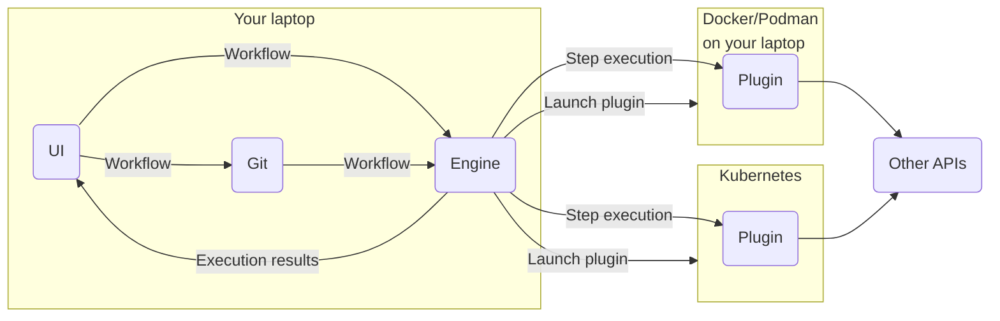

# Arcaflow: The noble workflow engine

Arcaflow is a workflow engine in development which provides the ability to execute workflow steps in sequence, in parallel, repeatedly, etc. The main difference to competitors such as [Netflix Conductor](https://conductor.netflix.com/) is the ability to run ad-hoc workflows without an infrastructure setup required.

The engine uses **containers** to execute plugins and runs them either locally in Docker/Podman or remotely on a Kubernetes cluster. The workflow system is *strongly typed* and allows for generating JSON schema and OpenAPI documents for all data formats involved.

A long-term goal is to provide the ability to package workflows and the engine together into **CLI tools**, **webservices**, **Kubernetes operators**, or integrated in a **CI system** with no additional coding work involved.

The planned **user interface** will allow for editing workflows and reviewing the executions in detail.

## Roadmap

Our roadmap can be found [on GitHub](https://github.com/orgs/arcalot/projects/5).

## Use cases

Our **primary use case** at this time is running **performance and chaos testing tools on demand**. Secondary use cases that we are considering:

- QE/testing
- Security testing
- ETL and other infrastructure migration jobs (once data streaming is available)

## Architecture

The Arcaflow architecture consists of the following 3 keys elements:

1. Plugins
2. The Engine
3. The User Interface

## Schemas

A core element of the Arcaflow system is the schema system. Each plugin and the engine itself will provide a machine-readable data structure that describes what inputs are expected and what outputs may be produced. If you are familiar with JSON schema or OpenAPI, this is similar, and Arcaflow can produce those schema documents. However, the Arcaflow system is stricter than those industry standards to optimize for performance and simpler implementation in all supported programming languages.

## Plugins

Plugins provide execution for one or more **steps** for a workflow. The job of a plugin is to *do one job and do it well*. They provide a thin layer over third party tools, or an own implementation of features. Their main job is to provide accurate input and output schema information to the engine and transform the data as needed.

For example, a plugin may output unformatted text, which a plugin has to parse and build a machine-readable data structure for that information. This reformatting of data allows the engine to pipe data between steps and reliably check the data for faults.

The current plan is to provide plugin SDKs for Python, GO, and Rust (in that order).

## Engine

The engine is responsible for the orchestration of the workflow steps. It has several duties:

1. Provide schemas for workflow files, read workflows and construct execution graphs.
2. Type-check the execution graphs to make sure that the data transfers between steps are typesafe.
3. Orchestrate plugin execution with Docker, Podman and Kubernetes.
4. Execute the workflow, following the [workflow rules](concepts/workflows.md).

The engine itself is designed to be run from a command line interface, possibly as a webserver, but is not designed to run in a redundant fashion. Instead of implementing redundancy itself, the engine will receive support to execute workflows in third party systems, such as Kafka.

A stretch goal for the engine is to make it fully embeddable, possibly with in-binary workflows and execution images to make them easily to ship in network-restricted environments. 

## User Interface

The user interface has two goals:

1. Allow users to edit workflows
2. Inspect workflow results, debugging possible failures 

Future possible extensions will allow for integrating the user interface into other systems for using the workflow engine as an embedded system.