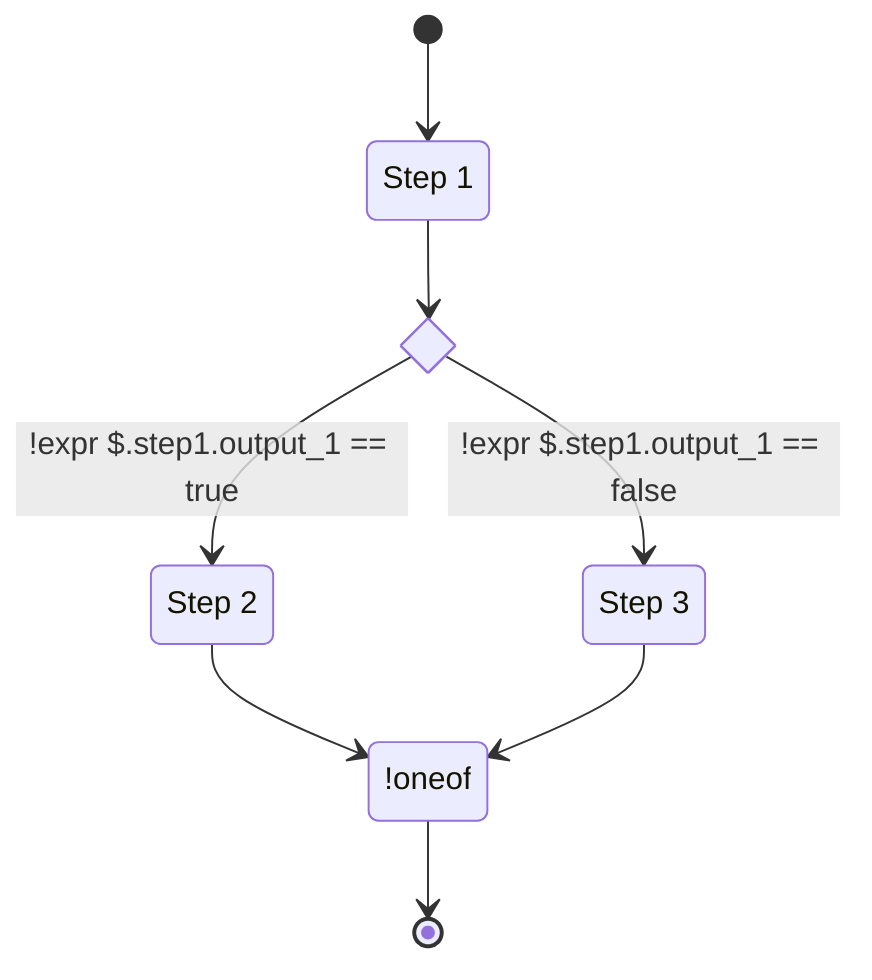
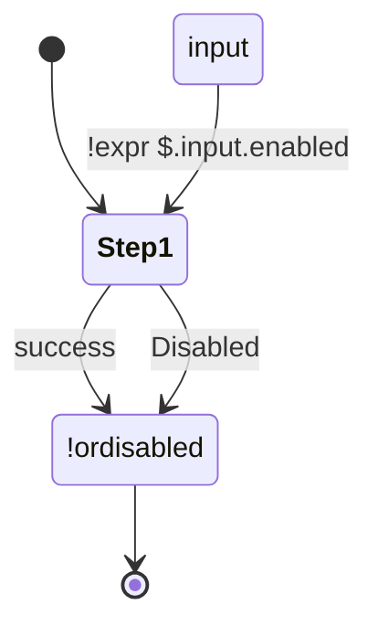

# Using Flow Control Mechanics

Flow control allows the workflow author to build a workflow with a decision tree based on supported flow logic. These flow control operations are not implemented by plugins, but are part of the workflow engine itself.

## Conditional Step Execution

Conditional step execution can be achieved with the `enabled` input.

The value passed into the `enabled` field should be an expression that resolves as a boolean. So it should either reference a path to a boolean value, or it should be a binary comparison.

A situation that would benefit from conditional step execution includes a step that uploads the result to a remote server. For development runs you may not want to upload the results, so you can create a `bool` field in the input to toggle the upload, then you can reference that field in the `enabled` field of the upload step.

Example:
```yaml title="workflow.yaml"
version: v0.2.0
input:
  root: RootObject
  objects:
    RootObject:
      id: RootObject
      properties:
        step_1_enabled:
          type:
            type_id: bool
        step_1_input:
          type:
            type_id: integer
steps:
  my_step:
    plugin:
      deployment_type: image
      src: path/to/my_plugin:1
    input:
      param_1: !expr $.input.step_1_input
    enabled: !expr $.input.step_1_enabled
outputs:
  workflow_success:
    plugin_output: !expr $.steps.my_step.outputs.success
```

But oh no! The workflow fails with the error `all outputs marked as unresolvable` when the step is disabled.
This happens because the workflow instructed the step not to run, and therefore the output `workflow_success`
cannot get the information it needs. See the next section for methods of handling this situation.

#### Graceful handling of disabled steps

When steps are disabled, they no longer emit their step output. To handle this, the workflow output (or a
following step) must have an OR dependency on both the step's disable output and on another step that has
opposite enable logic.
An OR dependency means that the step will resolve when any of the nodes it depends on resolve, unlike the
default AND logic that waits for all dependencies to resolve.


Here is a visual demonstrating two steps that have opposite logic:


Here is a visual demonstrating utilizing the disabled output:


The way this works is that either of the two paths can create a valid output, allowing the workflow to continue past
the disabled steps.

##### How to do this in a workflow

There are two tags that create the described OR dependency.

| Tag           | Description                                      |
|---------------|--------------------------------------------------|
| `!oneof`      | A general use tag to depend on any of the inputs |
| `!ordisabled` | A special case of `!oneof` that automatically handles the disabled case |

##### How to use `!oneof`

To use `!oneof` for graceful handling of disabled steps, the oneof should depend on ONE OF the success output and
the disabled output, which will output either the success output or the disabled output.

The oneof tag is a method of creating a schema `one_of_string` type from values present in the workflow.

The syntax of `!oneof` is:
- Following the tag `!oneof`, create a new YAML section (map) by starting an indented new line. That section should contain two properties:
  - discriminator: A string that specifies what the oneof discriminator should be. The discriminator specifies which option was outputted.
  - options: A YAML section (map) that contains all options. The keys are the discriminator values, and the values should be valid expressions.

Example:
```yaml title="workflow.yaml"
version: v0.2.0
input:
  root: RootObject
  objects:
    RootObject:
      id: RootObject
      properties:
        step_1_enabled:
          type:
            type_id: bool
        step_1_input:
          type:
            type_id: integer
steps:
  my_step:
    plugin:
      deployment_type: image
      src: path/to/my_plugin:1
    input:
      param_1: !expr $.input.step_1_input
    enabled: !expr $.input.step_1_enabled
outputs:
  workflow_success:
    plugin_output: !oneof
      discriminator: result
      options:
        enabled: !expr $.steps.my_step.outputs.success
        disabled: !expr $.steps.my_step.disabled.output
```

##### How to use `!ordisabled`

Arcaflow provides workflow developers an easy way to handle disabled steps that is as simple as changing the
expression tag from `!expr` to `!ordisabled`.

This is a special case of `!oneof` with the discriminator set to `result`, and the options set to `enabled` and
`disabled`. The enabled output is the expression provided, and the disabled output is automatically generated from
the expression provided.

The input must be in one of the following formats:
- `$.steps.step_name.outputs`
- `steps.step_name.outputs`
- `$.steps.step_name.outputs.output_name`
- `steps.step_name.outputs.output_name`
- `$.steps.step_name.outputs.output_name.output_field`
- `steps.step_name.outputs.output_name.output_field`

Using `!ordisabled`, the following example is otherwise equivalent to the prior example:
```yaml title="workflow.yaml"
version: v0.2.0
input:
  root: RootObject
  objects:
    RootObject:
      id: RootObject
      properties:
        step_1_enabled:
          type:
            type_id: bool
        step_1_input:
          type:
            type_id: integer
steps:
  my_step:
    plugin:
      deployment_type: image
      src: path/to/my_plugin:1
    input:
      param_1: !expr $.input.step_1_input
    enabled: !expr $.input.step_1_enabled
outputs:
  workflow_success:
    plugin_output: !ordisabled $.steps.my_step.outputs.success
```

#### Alternative methods

For handling disabled steps, `!oneof` and `!ordisabled` are the recommended methods because they cause output failure
when the step fails. However, if it is acceptable for the workflow to succeed when a step crashes, the optional tags
could be the right feature for your workflow.

The alterative methods are the "optional" family of expression tags. The `oneof` tags instructed the workflow to
build a `oneof_string` type with OR dependencies, requiring one of the options to have an output for the oneof to
resolve. Meanwhile, the "optional" family of tags can resolve without an output by utilizing optional object property
fields.

| Tag              | Description                                      |
|------------------|--------------------------------------------------|
| `!wait-optional` | The typical one that should be used. It will resolve either when the value becomes present, or when it is known that the value will not resolve. |
| `!soft-optional` | Not recommended for most use cases. It will not wait for the value to be ready. If the value is present, it will set the field. If it isn't, it will exclude it. |

##### How to use `!wait-optional`

```yaml title="workflow.yaml"
version: v0.2.0
input:
  root: RootObject
  objects:
    RootObject:
      id: RootObject
      properties:
        step_1_enabled:
          type:
            type_id: bool
        step_1_input:
          type:
            type_id: integer
steps:
  my_step:
    plugin:
      deployment_type: image
      src: path/to/my_plugin:1
    input:
      param_1: !expr $.input.step_1_input
    enabled: !expr $.input.step_1_enabled
outputs:
  workflow_success:
    plugin_output: !wait-optional $.steps.my_step.outputs.success
```

If `my_step` is enabled and has an output, it will be present in the `plugin_output` field of the `workflow_success`
output. Otherwise, the `workflow_success` output will not include the `plugin_output` field. The output will wait
for the plugin to finish, if enabled.

##### How to use `!soft-optional`

!!! warning
    This feature is not recommended for most use cases.

The `!soft-optional` tag creates the loosest type of dependency. The output will __not__ wait for the step to finish
or fail. In the event that the step referenced with the `!soft-optional` tag does not finish by the time the other
dependencies resolve, or if it crashes or is disabled, the field will be left out of the output.

The example used in `!wait-optional` would not work with `!soft-optional` because the output would immediately
resolve without the `plugin_output` field. A second dependency is required to ensure the output does not resolve immediately.

```yaml title="workflow.yaml"
version: v0.2.0
input:
  root: RootObject
  objects:
    RootObject:
      id: RootObject
      properties:
        background_step_enabled:
          type:
            type_id: bool
        background_step_input:
          type:
            type_id: integer
        step_1_input:
          type:
            type_id: integer
steps:
  background_step:
    plugin:
      deployment_type: image
      src: path/to/my_background_plugin:1
    input:
      param_1: !expr $.input.background_step_input
    enabled: !expr $.input.background_step_enabled
  my_step:
    plugin:
      deployment_type: image
      src: path/to/my_plugin:1
    input:
      param_1: !expr $.input.step_1_input
outputs:
  workflow_success:
    background_output: !soft-optional $.steps.background_step.outputs.success
    plugin_output: $.steps.my_step.outputs.success
```

## Foreach Loops

Foreach loops allow for running a sub-workflow with iterative inputs from a parent workflow. A sub-workflow is a complete Arcaflow workflow file with its own input and output schemas as described in this section. The inputs for the sub-workflow are provided as a list, where each list item is an object that matches the sub-workflow input schema.

!!! tip
    A complete functional example is available in the [arcaflow-workflows](https://github.com/arcalot/arcaflow-workflows/tree/main/examples/sub-workflow-foreach) repository.

In the parent workflow file, the author can define an input schema with the list that will contain the input object that will be passed to the sub-workflow. For example:

```yaml title="workflow.yaml"
input:
  root: RootObject
  objects:
    RootObject:
      id: RootObject
      properties:
        loop:
          type:
            type_id: list
            items:
              type_id: object
              id: loop_id
              properties:
                loop_id:
                  type:
                    type_id: integer
                param_1:
                  type:
                    type_id: integer
                param_2:
                  type:
                    type_id: string
```

Then in the `steps` section of the workflow, the sub-workflow can be defined as a step with the `loop` list object from above passed to its input.

The parameters for the sub-workflow step are:

  - `kind` - The type of loop (currently only foreach is supported)
  - `items` - A list of objects to pass to the sub-workflow (the [expression language](expressions.md) allows to pass this from the input schema per the above example)
  - `workflow` - The file name for the sub-workflow (this should be in the same directory as the parent workflow)
  - `parallelism` - The number of sub-workflow loop iterations that will run in parallel

```yaml title="workflow.yaml"
steps:
  sub_workflow_loop:
    kind: foreach
    items: !expr $.input.loop
    workflow: sub-workflow.yaml
    parallelism: 1
```

The input yaml file for the above parent workflow would provide the list of objects to loop over as in this example:

```yaml title="input.yaml"
loop:
  - loop_id: 1
    param_1: 10
    param_2: "a"
  - loop_id: 2
    param_1: 20
    param_2: "b"
  - loop_id: 3
    param_1: 30
    param_2: "c"
```

The sub-workflow file then has its complete schema and set of steps as in this example:

```yaml title="sub-workflow.yaml"
version: v0.2.0
input:
  root: RootObject
  objects:
    RootObject:
      id: RootObject
      properties:
        loop_id:
          type:
            type_id: integer
        param_1:
          type:
            type_id: integer
        param_2:
          type:
            type_id: string
steps:
  my_plugin:
    plugin:
      deployment_type: image
      src: path/to/my_plugin:1
    input:
      param_1: !expr $.input.param_1
  my_other_plugin:
    plugin:
      deployment_type: image
      src: path/to/my_other_plugin:1
    input:
      param_2: !expr $.input.param_2
outputs:
  success:
    loop_id: !expr $.input.loop_id
    my_plugin: !expr $.steps.my_plugin.outputs.success
    my_other_plugin: !expr $.steps.my_other_plugin.outputs.success
```

### Reduce Repetition with `bindConstants()`

The builtin function [`bindConstants()`](expressions.md#functions) allows you to
avoid repeating input variables for a `foreach` subworkflow. In the example
below, the input variable `name`'s value is repeated across each iteration in
this input. This results in a more repetitive input and schema definition. This
section will show you how to simplify it.

#### Workflow and Input Before `bindConstants()`

```yaml title="input-repeated.yaml"
iterations:
  - loop_id: 1
    repeated_inputs:
      name: mogo
      ratio: 3.14
  - loop_id: 2
    repeated_inputs:
      name: mogo
      ratio: 3.14
  - loop_id: 3
    repeated_inputs:
      name: mogo
      ratio: 3.14
  - loop_id: 4
    repeated_inputs:
      name: mogo
      ratio: 3.14
```

```yaml title="workflow.yaml"
version: v0.2.0
input:
  root: RootObject
  objects:
    RootObject:
      id: RootObject
      properties:
        iterations:
          type:
            type_id: list
            items:
              id: SubRootObject
              type_id: ref
              namespace: $.steps.foreach_loop.execute.inputs.items
           
steps:
  foreach_loop:
    kind: foreach
    items: !expr $.input.iterations
    workflow: subworkflow.yaml
    parallelism: 1

outputs:
  success:
    fab_four: !expr $.steps.foreach_loop.outputs.success.data
```

```yaml title="subworkflow.yaml"
version: v0.2.0
input:
  root: SubRootObject
  objects:
    SubRootObject:
      id: SubRootObject
      properties:
        loop_id:
          type:
            type_id: integer
        repeated_inputs:
          type:
            type_id: ref
            id: RepeatedInputs
    RepeatedInputs:
      id: RepeatedInputs
      properties:
        name:
          type:
            type_id: string
        ratio:
          type:
            type_id: float

steps:
  example:
    plugin:
      deployment_type: image
      src: quay.io/arcalot/arcaflow-plugin-template-python:0.4.0
    input:
      name: !expr $.input.repeated_inputs.name

outputs:
  success:
    loop_id: !expr $.input.loop_id
    ratio: !expr $.input.repeated_inputs.ratio
    beatle: !expr $.steps.example.outputs.success
```

#### Reduced Repetition Workflow

Here we restructure the input, factoring out the repeated `name` and `ratio` 
entries in the list and placing them into a single field; we will use 
`bindConstants()` to construct the `foreach` list with repeated entries.

```yaml title="input.yaml"
repeated_inputs: 
  name: mogo
  ratio: 3.14
iterations:
  - loop_id: 1
  - loop_id: 2
  - loop_id: 3
  - loop_id: 4
```

To use the generated values from `bindConstants()`, a new schema representing 
these bound values must be added to the input schema section of our 
`subworkflow.yaml`, `input`. This new schema's ID will be the ID of the schema 
that defines the items in your list, in this case `SubRootObject` and the 
schema name that defines your repeated inputs, in this case `RepeatedValues`, 
for more information see 
[Generated Schema Names](schemas.md#generated-combined-schema-names). This 
creates our new schema ID, `SubRootObject__RepeatedValues`. You are required 
to use this schema ID because it is generated from the names of your other 
schemas.

```yaml title="workflow.yaml"            
steps:
  foreach_loop:
    kind: foreach
    items: !expr 'bindConstants($.input.iterations, $.input.repeated_inputs)'
    workflow: subworkflow.yaml
    parallelism: 1
```

To use `bindConstants()` with an `outputSchema` in your workflow, you need to 
reference the schema of the list items returned by `bindConstants()`, see 
[Generated Schema Name](schemas.md#generated-combined-schema-names).

See the [full workflow](https://github.com/arcalot/arcaflow-workflows/blob/492e30ffbea6ce902e6e7ec050c4d1be307b6d73/basic-examples/bind-constants/workflow.yaml#L28).
