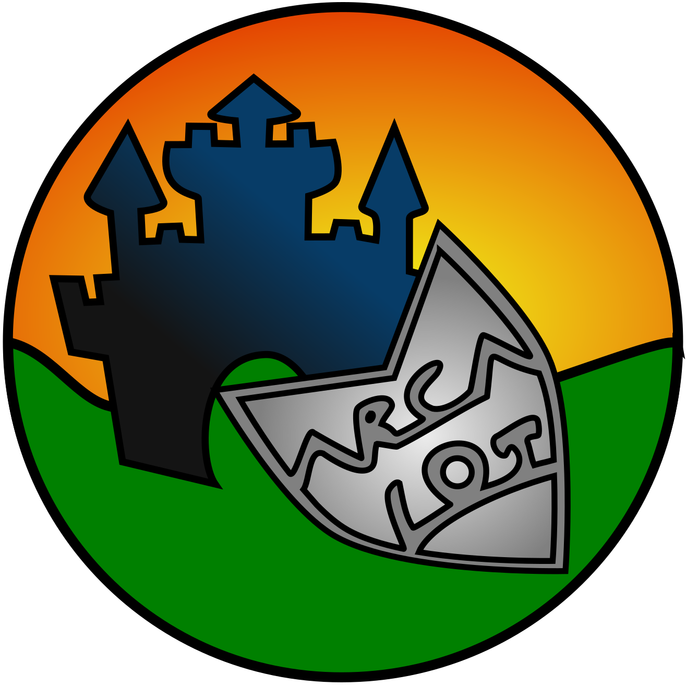

---
hide:
  - navigation
  - toc
---

# Arcalot: Another Repository Containing A Lot Of Things

The Arcalot community develops tools, plugins, and libraries that you can use either standalone as a library, and/or via a user interface or CLI. You can run the tools locally, remotely, or as part of a bigger system. Arcalot:

* Helps you create workflows with **normalized input and output schemas**
* Provides you with **assisted and automated root cause analysis** for the workflows you create as well as CI and other log systems
* Provides **stable plugins for several workloads**

---

## Arcaflow

Arcaflow is a **workflow engine** consisting of three main components:

* Core engine
* UI (planned)
* Plugins (including SDKs for Go and Python to write your own plugins)

It allows you to connect plugins into workflows of parallel and serial tasks for your target systems. The engine is run as a single portable binary and therefore does not require installation of its components onto the target systems. A future UI will allow you to click and drag plugins into a workflow and, if needed, feed the resulting data back into the UI for further analysis. There is a range of supported plugins, written either in Go or Python.

[Read more](arcaflow/){ .md-button }

---

## Arcalog

Arcalog can assist you with or automate your **root cause analysis** in CI or other log systems either as a standalone tool or by embedding it into your applications.

It also provides additional tooling to download jobs from various log systems or add your own log files for analysis.

[Read more](arcalog/){ .md-button }

---

## Community

You can find our general community health files like our code of conduct and contribution guidelines in the [.github repository](https://github.com/arcalot/.github). If you have any questions or suggestions, please use the issues in the respective repository or contribute to the [discussions](https://github.com/orgs/arcalot/discussions).

If you would like to contribute, check out the issues in the individual repositories and our [project boards](https://github.com/orgs/arcalot/projects) where we organize our work.

If you want to participate in our bi-weekly meeting you can add our recurring meeting to your calendar: [Arcalot Project Community meeting (iCal)](meetings/arcalot-community-biweekly.ics)
